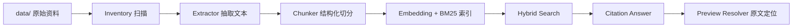

# 知识库查询引擎架构说明

## 1. 定位

知识库查询引擎首版定位为 `检索 + 引用型问答 + 原文定位`。

它服务审计员查法规、政策、规则、医保目录依据，不直接替代规则引擎输出合规判定。合规判断后续由结构化规则和审计数据链路承担，知识库负责提供可追溯依据。

## 2. 核心边界

- 知识库、索引、文档元数据、chunk 和引用链本地保存。
- 模型调用通过 provider 抽象，开发期可用云端 API，交付版可替换为私有化模型。
- 开发期禁止上传患者数据到外部模型服务。
- `data/` 原始资料只读，索引产物写入 `index_root`。
- OCR 不进入首版，扫描件和图片进入待处理队列。

## 3. 知识集合

首版固定四类来源集合：

- `medical-insurance-catalog`：医保目录、DRG/DIP 目录、药品目录等。
- `supervision-rules-knowledge`：智能监管“两库”规则和知识点。
- `risk-negative-list`：风险负面清单、违规风险案例。
- `medical-insurance-laws`：医保、医疗、药品、基金监管、处方、门特相关法律政策。

`全量法律` 不做无差别索引，只抽取与医保审核和医疗审计相关的文本进入首版索引。

## 4. 数据流

## 5. 切分与定位

- 法规政策按条款、章节和标题层级切分。
- Markdown/txt 保留 `line_start`、`line_end` 和标题上下文。
- PDF 保留 `page_number`。
- xlsx 保留 `sheet_name` 和 `row_number`。
- 每个 chunk 必须保留 `source_collection`、`source_path`、`index_version_key`、`source_package_version_key`。

## 6. 检索链路

检索采用 `BM25 + vector + source weight + optional rerank`。

- BM25 负责精确术语、政策号、条款号和规则名称召回。
- 向量检索负责自然语言语义召回。
- 来源权重提升业务上更可信的规则来源。
- rerank 用于对混合召回结果重新排序。
- 元数据过滤支持来源集合、年份、地区、文档类型、业务主题。

### 6.1 当前索引状态

当前已完成真实资料的本地持久化索引闭环：

- 持久化产物：`tmp/knowledge-query-indexes/real-data-20260531`
- chunk 数量：`48985`
- embedding 数量：`48985`
- BM25 document 数量：`48985`
- 当前 embedding provider：`fake`

该索引用于工程闭环和评测流程验证，不代表最终语义检索质量。

### 6.2 第三方 Embedding Provider

已实现 OpenAI-compatible embedding provider。接入第三方模型时必须提供：

- API key 环境变量名
- `/v1/embeddings` 兼容 base URL
- embedding model 名称
- embedding dimension
- batch size

如果第三方 provider 不兼容 OpenAI embeddings 协议，必须先新增专用 adapter，不能把不兼容响应伪装成 OpenAI-compatible。

### 6.3 Kimi Code Smoke 状态

Kimi Code OpenAI-compatible provider 已完成最小验证：

- base URL：`https://api.kimi.com/coding/v1`
- model：`kimi-for-coding`
- dimension：`1024`
- smoke index：`tmp/knowledge-query-indexes/real-data-kimi-smoke-20260531`
- smoke chunk 数量：`100`
- smoke embedding 数量：`100`
- smoke BM25 document 数量：`100`
- smoke 评测：`10` cases，`recall@5=90%`，`citation_hit_rate=90%`，`preview_location_success_rate=100%`

该 smoke 只验证 provider 连通性、向量写入、查询向量一致性和预览链路。由于小批量样本仅覆盖 `2` 个排序靠前的法规文件，不能作为最终检索质量判断。

### 6.4 Kimi Code 全量索引状态

Kimi Code 全量真实 embedding 索引已完成：

- 持久化产物：`tmp/knowledge-query-indexes/real-data-kimi-20260531`
- chunk 数量：`48985`
- embedding 数量：`48985`
- BM25 document 数量：`48985`
- indexed file 数量：`486`
- failed file 数量：`0`
- pending file 数量：`13`
- embedding provider：`openai`
- embedding model：`kimi-for-coding`
- embedding dimension：`1024`
- artifact size：约 `917M`

当前已完成 `100` case 全量索引评测，`recall@5=100%`，`citation_hit_rate=100%`，`preview_location_success_rate=100%`。

为支撑全量评测，`InMemoryVectorIndex` 已加入 NumPy 加速路径：无过滤条件的向量检索使用归一化矩阵和向量化 dot product，带过滤条件的检索仍保留 Python fallback。

当前已建立固定人工评测集 V1：

- dataset：`configs/evaluation/knowledge-query-human-evaluation-cases-v1.yaml`
- case 数量：`52`
- 覆盖范围：智能监管规则、医保目录、风险负面清单、地方医疗保障法规
- Kimi 全量索引评测：`recall@5=100%`，`citation_hit_rate=100%`，`preview_location_success_rate=100%`

固定集评测已暴露并处理三类问题：`A00.0` 这类 ICD 编码检索被高频章节词拉偏，已通过 tokenizer 和 BM25 精确编码命中权重修复；`医疗服务项目重复收费` case 首次预期源文件过窄，已调整为实际命中的第七批 Excel 知识点明细；`诊断编码与手术操作编码不符` case 首次使用了规范化转述，已调整为源文真实表述。

当前已建立答案级评测集 V1：

- dataset：`configs/evaluation/knowledge-query-answer-evaluation-cases-v1.yaml`
- case 数量：`8`
- 覆盖范围：有依据回答、依据不足拒答、目录编码解释、药品目录剂型、监管规则引用
- Kimi 全量索引 fallback 答案级评测：`pass_rate=100%`，`citation_marker_rate=100%`，`answer_term_coverage_rate=100%`，`citation_term_coverage_rate=100%`，`refusal_accuracy_rate=100%`，`unsupported_claim_free_rate=100%`
- Kimi Code 真实生成评测：`pass_rate=25%`，`generation_success_rate=0%`，`fallback_rate=100%`

答案级评测暴露并处理两类问题：空禁用词被误判为命中，已修复为“未配置禁用词时默认通过”；fallback answer 曾输出全部 Top-K 引用，导致相邻目录项进入答案，已改为按问题焦点词筛选引用，并对 `A00.0`、`0000` 等领域编码优先聚焦。

Kimi Code 真实生成评测未通过的根因不是检索质量，而是 chat completion 访问受限：`kimi-for-coding` 对 `/chat/completions` 返回 `403 access_terminated_error`，提示仅可用于 Kimi CLI、Claude Code、Roo Code、Kilo Code 等 Coding Agents。当前系统只能确认 Kimi embedding 可用，不能确认 Kimi Code 可作为线上答案生成模型。

当前已新增 Anthropic Messages API answer provider 适配器，使用 `/v1/messages` 和 `anthropic-version: 2023-06-01`。本地环境检测到 `ANTHROPIC_API_KEY`，但预检返回 `401 authentication_error: invalid x-api-key`，因此也不能视为当前可用 chat provider。

### 6.5 PostgreSQL + pgvector 迁移状态

当前生产迁移目标是将 `tmp/knowledge-query-indexes/real-data-kimi-20260531` 的 JSONL artifact 导入 PostgreSQL + pgvector，避免 API 运行时继续依赖 917M 本地索引文件和内存矩阵加载。

当前 schema 状态：

- schema 文件：`sql/knowledge-query-schema.sql`
- PostgreSQL 镜像：`pgvector/pgvector:pg16`
- 向量列：`chunk_embeddings.embedding vector(1024)`
- 维度约束：`ck_chunk_embeddings_dimension_1024`
- Kimi HNSW 索引：`idx_chunk_embeddings_kimi_cosine_hnsw`
- 过滤辅助索引：`document_chunks.metadata`、`document_chunks.locator`、`query_logs.filters` 的 GIN 索引
- 复核数据底座：`review_tasks` 保存任务、复核意见、复核结论和底稿快照，`review_actions` 保存状态流转与操作流水，`review_comments` 保存人工复核评论
- V1.0 业务数据底座第一批：`audit_projects`、`audit_data_snapshots`、`audit_tasks`、`audit_runs`、`audit_rules`、`rule_versions`、`audit_findings`、`finding_evidence_items`，用于把疑点追溯到审计项目、数据快照、运行批次、规则版本和知识证据项

页面复核任务运行态：

- `ApiState.from_settings` 默认使用 `SqlAlchemyReviewTaskStore(settings.database_url)`。
- `/pages/review-tasks` 的创建、列表、状态更新和导出默认读写 PostgreSQL。
- `/pages/audit-findings` 默认使用 `SqlAlchemyAuditFindingStore(settings.database_url)` 读取 `audit_findings` 和 `finding_evidence_items`，支持疑点 JSON 导出和创建复核任务。
- JSON store 只保留为测试和应急替换路径，不再作为生产默认持久化。
- 当前已完成任务级复核持久化、审计业务数据底座第一批、`CHARGE-RULE-001` 开发期 fixture 执行器和开发期疑点清单接入；用户权限、多实例强一致编号、负责人确认、附件、正式报告门禁、正式规则发布和真实 HIS 数据导入仍属于后续案件级审计流。

该 schema 与当前 Kimi 主索引一致，但不兼容 `text-embedding-3-small` 的 `1536` 维向量。切换 embedding model 时必须新增对应 migration 或新向量表，不能在同一 `vector(1024)` 列中混写不同维度。

导入前校验状态：

- CLI：`medical-audit-kb pgvector-import-plan`
- 报告：`drafts/analysis/knowledge-query-pgvector-import-plan-kimi-draft-20260601.md`
- JSON：`tmp/outputs/knowledge-query-pgvector-import-plan-kimi-20260601.json`
- `ready_for_import`: `true`
- `chunks.jsonl`: `48985`
- `embeddings.jsonl`: `48985`
- `failed_files.jsonl`: `0`
- `pending_files.jsonl`: `13`

受控导入 dry-run 状态：

- CLI：`medical-audit-kb pgvector-import`
- 报告：`drafts/analysis/knowledge-query-pgvector-import-dry-run-kimi-draft-20260601.md`
- JSON：`tmp/outputs/knowledge-query-pgvector-import-dry-run-kimi-20260601.json`
- `ready_for_write`: `true`
- `source_document_count`: `486`
- `document_chunk_count`: `48985`
- `chunk_embedding_count`: `48985`
- `source_file_missing_count`: `0`
- `invalid_source_metadata_count`: `0`

受控导入执行状态：

- 报告：`drafts/analysis/knowledge-query-pgvector-import-execute-kimi-draft-20260601.md`
- JSON：`tmp/outputs/knowledge-query-pgvector-import-execute-kimi-20260601.json`
- `executed`: `true`
- `success`: `true`
- `source_documents`: `486`
- `document_chunks`: `48985`
- `chunk_embeddings`: `48985`
- `failed_files`: `0`
- `pending_files`: `13`
- `orphan_embedding_count`: `0`
- `missing_embedding_count`: `0`
- `invalid_dimension_count`: `0`
- HNSW 向量检索 smoke query 已通过。
- 历史导入发生在 candidate/activate 流程落地前，因此当前 Kimi 主索引已是 active。

当前版本发布机制：

- `pgvector-import --execute` 默认写入 `candidate` 版本。
- `medical-audit-kb index-activate` 负责把候选版本切换为 active。
- `medical-audit-kb index-rollback` 负责把历史 `inactive` 或当前 `active` 版本恢复为 active；`candidate` 不允许作为 rollback 目标。
- 激活时，同一 `vector_provider` + `vector_model` 下旧 active version 会被置为 `inactive`。
- PostgreSQL vector 查询、BM25 加载和后端加载前的 embedding 计数均已限制为 active version + indexed documents。
- API 进程内 BM25 索引在加载 PostgreSQL 后端时构建，因此 active 切换后必须重新加载检索后端。

PostgreSQL 检索路径状态：

- 新增 CLI：`medical-audit-kb evaluate-postgres-index`
- 新增 CLI：`medical-audit-kb index-incremental-plan`
- 新增 CLI：`medical-audit-kb index-activate`
- 新增 CLI：`medical-audit-kb index-rollback`
- 新增 API 管理入口：`GET /index/postgres-status`、`GET /index/search-backend`、`POST /index/search-backend/postgres`、`POST /index/versions/activate`、`POST /index/versions/rollback`、`POST /index/evaluation/run`、`GET /index/evaluation/history` 和 `GET /index/evaluation/latest/export`
- `GET /pages/index-admin` 已接入 `Release Console`、`Acceptance Panel` 和验收历史面板，按“发布/回滚版本 -> 重载 PostgreSQL 后端 -> 固定验收 -> smoke question -> 历史复盘”组织运维动作。
- `POST /index/evaluation/run` 使用当前 API 进程内 `search_engine` 运行固定检索评测、fallback 答案评测和第一条引用原文预览解析；结果同步写入进程内 `evaluation_runs`、`index_root/evaluation-runs/` JSON 报告，并在 PostgreSQL 后端运行时写入 `index_evaluation_runs` 历史表。
- `GET /index/evaluation/history` 优先读取 `index_evaluation_runs`，数据库不可用时降级读取 JSON 报告列表，避免历史入口因 PostgreSQL 短暂不可用而完全失效。
- 当前增量计划报告：`drafts/analysis/knowledge-query-incremental-plan-current-draft-20260602.md`
- 当前增量计划结果：`added_files=0`，`modified_files=0`，`deleted_files=0`，`unchanged_files=486`，`pending_files=13`
- pgvector self-query smoke：`tmp/outputs/knowledge-query-postgres-vector-self-query-smoke-20260601.json`，`passed=true`
- PostgreSQL 数据源 BM25 固定 52 case：`drafts/analysis/knowledge-query-postgres-bm25-evaluation-v1-draft-20260601.md`
- BM25 固定 52 case：`recall@5=100%`，`citation_hit_rate=100%`，`preview_location_success_rate=100%`
- 固定 52 case 的真实 pgvector+Kimi 查询向量评测待有效 `KIMI_API_KEY` 后执行。

API 运行态默认不自动加载 PostgreSQL 检索后端。原因是当前 `configs/knowledge-query-engine-dev.yaml` 仍保留 `text-embedding-3-small` 开发配置，而数据库主索引是 `openai/kimi-for-coding/v1/1024`。运行态切换必须显式传入 Kimi provider 参数和 `KIMI_API_KEY` 环境变量名，并在加载前校验 `chunk_embeddings` 中存在匹配的 provider、model、provider version 和 dimension，避免模型维度或 provider 不一致时出现假成功。

迁移计划草稿：`drafts/docs/architecture-knowledge-query-engine-pgvector-migration-plan-draft-20260601.md`。

## 7. 引用型回答

回答生成必须满足：

- 无引用结果时不得生成答案。
- 每条引用必须绑定 chunk、locator、索引版本和资料包版本。
- 依据按法规、规则、目录、风险案例分组。
- fallback 答案只输出与问题焦点强相关的引用片段，不机械拼接全部 Top-K 检索结果。
- 领域编码、目录编号和诊断编码优先作为答案引用焦点。
- 生成模型失败或不可用时返回检索依据型 fallback 答案。
- 原文预览必须从引用 locator 回到源文件位置。

## 8. 索引版本

每次全量重建、增量索引或单文件重试都生成运行摘要。查询结果和引用必须可追溯到：

- `source_package_version_key`
- `index_version_key`
- `chunk_id`
- 原始文件路径与 locator

## 9. 验收指标

- 可索引文件成功率不低于 `95%`。
- 不可处理文件必须进入失败队列或待处理队列，不能静默丢失。
- 查询结果必须返回索引版本、资料包版本和引用定位。
- 评测集 `recall@5` 达到内部基线后再进入生成质量评估。
- 引用答案不得出现无来源结论。
- 原文预览必须能定位 Markdown/txt 行、PDF 页码、xlsx 行。

## 10. 当前门禁状态

真实第三方 embedding 全量构建已完成。当前门禁状态：

- smoke test 成功返回向量，并确认维度与参数一致。当前 Kimi Code 已完成。
- 小批量索引构建成功，至少覆盖 `100` 个 chunk。当前 Kimi Code 已完成。
- 小批量评测报告生成成功。当前 Kimi Code 已完成。
- 全量 Kimi embedding 构建完成，且支持 `--resume` 失败续跑。
- 全量索引 `100` case 评测完成。
- 固定人工评测集 V1 已完成，`52` case 全部命中。
- 答案级 fallback 评测集 V1 已完成，`8` case 全部通过。
- OpenAI-compatible 和 Anthropic 真实生成 provider 已接入评测链路，但当前可用密钥/模型组合均未通过 provider 预检。
- pgvector schema 已对齐当前 Kimi `1024` 维主索引，并建立 Kimi cosine HNSW 索引草案。
- 下一步质量评测需要更换可用 chat model 或接入 Kimi 官方允许的 Coding Agent 方式，再复跑真实生成评测。

当前不再重复启动 `48985` 个 chunk 的全量外部 embedding 调用，除非数据源或 embedding provider 发生变化。
