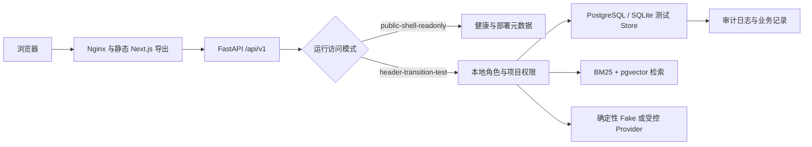
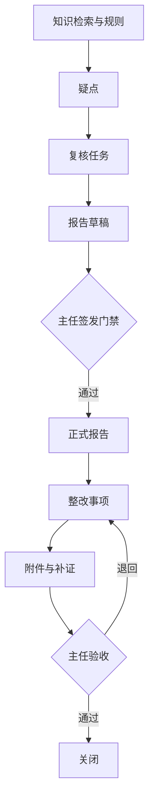

# AI 审计一体化协作平台系统架构

平台面向医院私有化审计场景，核心流程是「知识依据 → 合规判断与疑点 → 底稿与报告 → 整改跟踪」。本轮不建设可信登录；生产只开放不含真实业务数据的产品导览、健康状态和部署元数据。

## 系统边界



生产构建使用 Next.js 静态导出。浏览器加载公开页面后，`NEXT_PUBLIC_MEDICAL_AUDIT_API_ACCESS_MODE=public-shell-readonly` 阻止受保护 API 请求，并隐藏角色切换、上传、创建、签发和状态变更操作。

## 主要组件

| 组件 | 路径 | 职责 | 当前边界 |
|---|---|---|---|
| Next.js 前端 | `web/` | 20 个独立页面、3 个兼容别名、角色化交互 | 生产只读导览；本地可使用角色模拟器 |
| FastAPI 应用 | `src/medical_audit_kb/api/` | API、权限、业务编排、错误合同 | `/api/v1` 是规范入口 |
| SQLAlchemy Store | `src/medical_audit_kb/api/*_store.py` | 项目、成员、疑点、任务、整改、上传和日志 | 生产使用 PostgreSQL；本地 E2E 使用临时 SQLite |
| 检索引擎 | `src/medical_audit_kb/retrieval/` | BM25、向量检索、重排和引用 | Provider 可用性与索引状态独立判定 |
| 运维脚本 | `scripts/` | 构建、manifest、部署、L3 检查和验收 | 写操作均有独立门禁 |
| 部署配置 | `configs/deploy/tencent-cloud/` | Compose、环境模板和 Nginx 配置 | 生产默认 `public-shell-readonly` |

## 访问门禁

### `public-shell-readonly`

该模式是生产默认值。统一中间件位于认证和审计业务处理之前，仅允许：

- `GET` 或 `HEAD` 访问静态页面和静态资源。
- `GET` 或 `HEAD` 访问 `/health`、`/api/v1/health` 和兼容健康入口。
- `GET` 或 `HEAD` 访问 `/deployment/metadata`、`/api/v1/deployment/metadata` 和兼容入口。
- 访问 `/release-manifest.json`。

所有业务 API 和所有非 `GET`、`HEAD` 方法返回 `503`：

```json
{
  "detail": {
    "code": "trusted_identity_required",
    "message": "可信身份认证尚未启用，生产业务数据访问已关闭。",
    "access_mode": "public-shell-readonly"
  }
}
```

响应包含 `Cache-Control: no-store`。门禁在业务 Store 和审计日志之前返回，因此受阻请求不得新增业务记录或审计事件。

### `header-transition-test`

该模式只用于本地测试。请求通过 `X-User-Id`、`X-Role`、`X-Tenant-Id` 和项目上下文模拟身份。它不是可信登录方案，不得进入生产构建。

## 权限与项目可见性

- 普通成员可创建复核任务、报告草稿和整改事项，但只能访问可见项目。
- 主任额外拥有 `SIGN_REPORTS`，可验收整改、关闭已验收事项和正式签发报告。
- 技术人员负责索引和技术配置，不得签发报告。
- 管理员负责用户、项目和系统管理；当前权限矩阵不授予 `SIGN_REPORTS`。
- 对不可见项目的疑点、任务、整改和附件统一返回 `404`，不泄露对象是否存在。

## 审计业务流程



整改状态机由后端返回 `allowed_transitions` 和 `can_upload_attachment`。前端只渲染服务端允许的操作，不自行推导权限。

## 数据真实性

- `persistent`：数据来自持久化 Store，可按角色和项目操作。
- `sample`：只用于产品导览，响应含 `data_mode=sample`、`writable=false`，不显示上传或状态按钮。
- `unavailable`：Store 不可用；页面显示失败状态，不回退成看似真实的数据。
- `public-shell-readonly`：前端不请求业务 API，页面只展示不含真实业务数据的导览内容。

`rules` 和 `archive` 当前仍含 Sample/Preview 能力。它们不得在文档中描述为完整持久化功能。

## API 路径

- 规范入口：`/api/v1/*`。
- 兼容入口：根路径和 `/api/backend/*`。
- 新代码和文档只引用规范入口；兼容入口在迁移完成前保留。

## 部署拓扑

生产静态发布使用按 Git SHA 命名的不可变目录和 `current` 符号链接。release manifest 绑定源 SHA、lockfile、公开构建变量和文件哈希。FastAPI 容器通过部署 SHA 文件暴露运行身份。

部署不属于本轮默认授权。候选合并、推送和 exact-SHA 部署必须分别获得明确授权；部署后只运行 L3 健康、manifest、20+3 导航和受保护 GET 的 `503` 负向检查。

## 已知限制

- 可信 SSO/OIDC 和身份代理尚未建设。
- 生产业务读取、写入和 Provider UAT 均未执行。
- 真实 HIS、DLP、OCR/LLM Provider 和医院现场验收未完成。
- rules、archive 和部分智能体配置仍为 Sample/Preview。
- 性能基线、告警/Webhook、灾备和隔离恢复演练仍待独立门禁。
