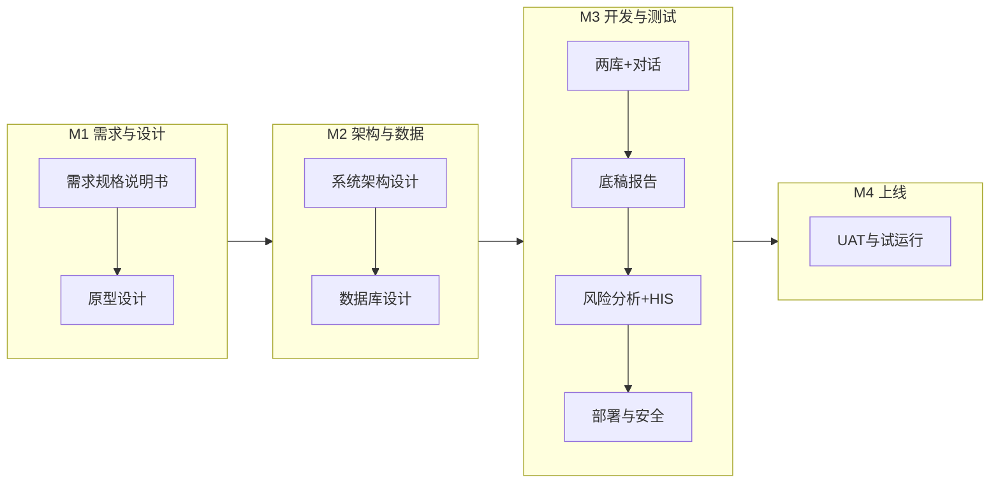

# AI 医疗审计系统 V1.0 开发计划

## 1. 目标与约束

- **目标**：以最高效方式跑通单院定制 MVP，实现「合规检测 → 风险预警 → 审计执行 → 报告生成 → 整改跟踪」闭环。
- **约束**：3–4 人团队、约 180 人天、Web 仅、仅对接 HIS、验收由审计员签字、试运行 1 个月后视情况正式割接。
- **范围**：智能审核两库（法规+知识+试点省地方特色库）、智能对话/查询、审计底稿与报告、医保合规风险分析（二分类）、HIS 对接、本地部署与离线更新（内容包+模型+整系统）。

---

## 2. 阶段与里程碑（与文档对齐）

| 里程碑    | 计划时间   | 交付物           | 验收标准              |
| ------ | ------ | ------------- | ----------------- |
| **M1** | T+5 周  | 需求规格说明书、原型设计  | 需求评审通过（信息科+审计科主任） |
| **M2** | T+10 周 | 系统架构设计、数据库设计  | 架构评审通过            |
| **M3** | T+30 周 | V1.0 核心功能开发完成 | 功能测试通过            |
| **M4** | T+36 周 | UAT 完成、试运行启动  | 审计员验收签字、试运行 1 个月  |

说明：M3 周期较长（约 20 周开发），可按「迭代交付、分批演示」方式在 T+20w / T+25w 安排中间演示，便于院方提前反馈。

---

## 3. 模块顺序与依赖

**关键外部依赖（需尽早锁定）**

- **HIS 接口文档与联调环境**：由院方/厂商在「对接开发前约 2 周」提供（文档建议）；若未商定，需在 M1 内与信息科工程师明确责任人与时间。
- **院方验证/测试集**：院方 1 个月内提供，用于算法验收（92% 按条数准确率）；标注规范与质量由审计科确认。
- **数据表结构与模板**：院方先提供，项目组生成虚拟数据用于开发与联调。

**建议开发顺序（按依赖与价值排序）**

1. **基础底座（M2 结束后即启动）**
   - 技术选型定稿：Java（Spring Boot）业务与接口、Python 算法服务，二者通过 HTTP/消息通信；数据库、缓存、MQ 选型。
   - 本地部署与安全基线：部署脚本、敏感信息加密、基础权限与审计日志，满足「敏感信息加密」与后续等保预留。
2. **两库 + 智能对话/查询（优先跑通主链路）**
   - 法规库、知识库、试点省地方特色库的模型与 API；支持内容导入与离线更新包（内容包）。
   - 对话/查询：法规与政策查询、知识问答、合规性判断、风险提示；可先实现「检索 + 简单对话」，再增强 NLU/多轮。
3. **HIS 对接与数据管线**
   - 依赖 HIS 接口文档与表结构/模板；实现数据抽取/同步、清洗与落库，支撑风险分析与底稿。
   - 使用虚拟数据先行开发，真实环境联调在文档与环境到位后进行。
4. **医保合规风险分析**
   - 二分类模型（合规/不合规）；训练数据来自历史审计数据（项目组标注、审计科确认）+ 院方后续提供的验证/测试集。
   - 支持模型/规则离线更新；输出风险标记、等级与预警，并落入底稿与报告。
5. **审计底稿与报告**
   - 底稿管理：模板、协作流程、证据挂接。
   - 报告生成：专项/综合/整改报告，自动生成与导出；与风险分析结果、两库引用打通。
6. **项目管理（权限与归档）**
   - 项目创建、任务分解、进度跟踪（甘特图/看板）、权限与数据隔离、归档；满足「审计员/科室主任」使用与验收签字场景。
7. **离线更新与发布**
   - 支持三类离线更新：法规/知识库内容包、模型/规则包、整系统安装/升级包；定义包格式、版本与回滚策略。

---

## 4. 工时与角色分配（参考文档 180 人天）

| 模块             | 设计     | 开发   | 测试    | 小计        | 说明                     |
| -------------- | ------ | ---- | ----- | --------- | ---------------------- |
| 智能审核两库 + 地方特色库 | 含在总体设计 | 约 40 | 含在开发内 | 约 40      | 法规/知识/试点省，含内容与离线包      |
| 智能对话/查询        | -      | 约 25 | -     | 约 25      | 与两库联动，可分期实现            |
| 审计底稿与报告        | -      | 约 30 | -     | 约 30      | 模板、协作、报告生成             |
| 医保合规风险分析       | -      | 约 60 | -     | 约 60      | 二分类模型、标注、92% 验收        |
| HIS 对接与数据管线    | -      | 约 20 | -     | 约 20      | 依赖接口文档与表结构             |
| 本地部署与安全        | -      | 约 30 | -     | 约 30      | 部署、加密、权限、审计日志          |
| 项目管理（权限/进度/归档） | -      | 约 15 | -     | 约 15      | 精简到 MVP 必要功能           |
| **合计**         | -      | -    | -     | **约 220** | 若严格 180，可压缩对话与项目管理首版范围 |

建议：首版严格按 180 人天裁剪——例如对话先做「检索+单轮问答」、项目管理先做「项目+任务+权限」，甘特图/看板可放 V1.1。

---

## 5. 技术架构建议（从零搭建）

- **前端**：Vue 3 + Element Plus，单页应用；路由与权限与「审计员/科室主任」角色对齐。
- **后端**：
  - Java（Spring Boot）：用户与权限、项目管理、底稿与报告、两库 CRUD 与查询 API、对话编排、调用 Python 服务。
  - Python：法规/知识检索与匹配、对话 NLU/生成（若用模型）、风险二分类模型推理与规则引擎；提供 HTTP/gRPC 或消息接口。
- **数据**：关系型 DB（主业务）+ 可选缓存（会话/热点查询）；审计与风险结果落库供底稿与报告使用。
- **部署**：本地私有化部署（如 Docker Compose 或安装包）；敏感信息加密存储与传输；支持离线更新（内容/模型/整包）。

不约定具体中间件时，建议：Java 与 Python 通过 HTTP 或内部 MQ 通信；DB 选型以团队熟悉度与院方环境为准。

---

## 6. 风险与应对

| 风险            | 应对                                   |
| ------------- | ------------------------------------ |
| HIS 接口文档/环境延迟 | M1 内与信息科明确提供方与时间；用表结构+虚拟数据先做数据模型与管线。 |
| 算法 92% 准确率不达  | 分阶段迭代；尽早拿到院方测试集；标注规范与审计科确认流程前置。      |
| 等保/合规后续加码     | 架构预留审计日志、加密、权限隔离；等院方确认是否硬性后再排专项。     |
| 试运行期暴露重大缺陷    | 定义 P0/P1 与响应时间；不驻场则明确远程支持窗口与升级路径。    |

---

## 7. 交付物清单（按阶段）

- **M1**：需求规格说明书、原型（含主要角色与核心流程）、《V1.0 验收标准》初稿（供 M2 前与院方确认）。
- **M2**：系统架构说明、数据库设计、接口清单（含 Java–Python 边界）、部署与安全方案概要。
- **M3**：可部署的 V1.0 应用、部署与运维说明、离线更新说明与示例包。
- **M4**：UAT 通过记录、审计员签字、试运行计划（1 个月）与培训材料（线上集中培训用）。

---

## 8. 建议的下一步（不改变当前代码库）

1. 与院方确认：HIS 接口文档与联调环境提供方及时间、院方测试集提供时间与格式。
2. 内部定稿：Java/Python 边界与通信方式、DB 与关键中间件选型。
3. 在 M1 内完成需求与原型评审，并锁定《V1.0 验收标准》终稿。

以上计划可直接用于排期与任务分解；若需把某一块拆成更细的迭代（如「两库+对话」拆成 2–3 个 sprint），可在执行阶段按当前节奏再细化。
