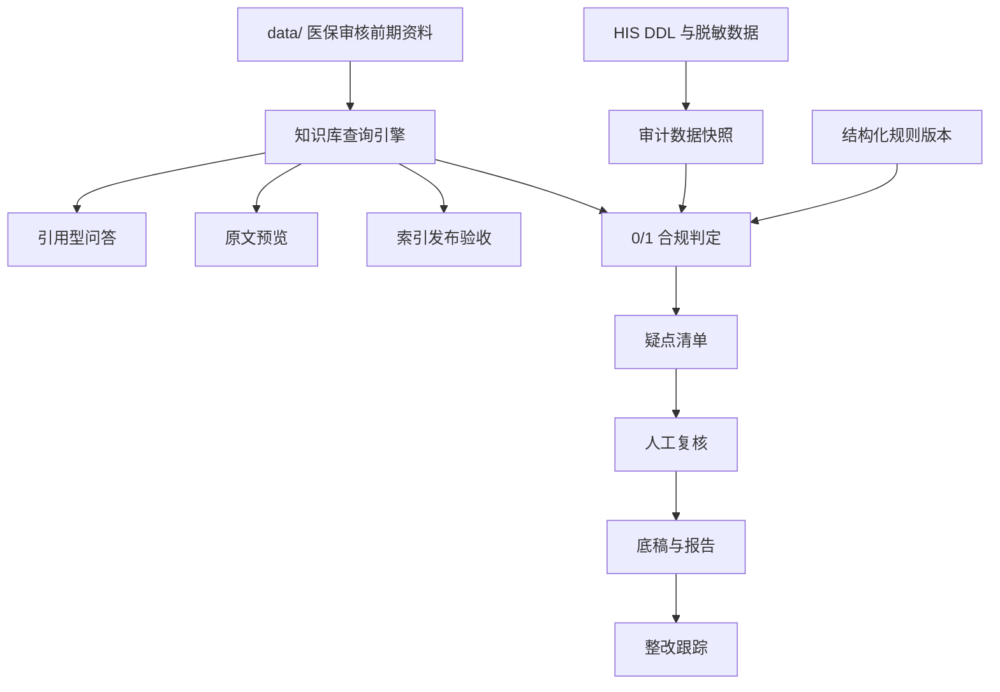

# AI 医疗审计系统 V1.0 PRD

## 1. 产品定位

AI 医疗审计系统 V1.0 是面向公立医院内审场景的私有化医疗/医保合规审计 MVP。

首版不做通用 SaaS、不做开放式 AI 聊天工具、不做多院多租户平台。产品目标是先在单院环境内跑通一条可验收闭环：

```text
知识依据查询 -> HIS 数据审计 -> 疑点识别 -> 人工复核 -> 底稿/报告 -> 整改跟踪
```

当前仓库已先行实现的是“知识库查询引擎”子系统，用于法规、目录、监管规则和负面清单的检索、引用型回答、原文预览和索引发布验收。它是 V1.0 的知识支撑层，不等同于完整审计判定系统。

## 2. 业务目标

### 2.1 V1.0 必须达成

- 在单院私有化环境内完成可演示、可试运行的医疗/医保审计 MVP。
- 仅接入 HIS 数据，完成一个首选细分审计场景的 0/1 合规判定。
- 每条疑似问题必须能追溯到规则、原始数据、计算过程和知识依据。
- 审计员可完成复核、底稿沉淀、报告导出和整改状态跟踪。
- 系统支持本地部署、权限控制、审计日志和离线内容/规则更新。

### 2.2 V1.0 不承担

- 不接入 LIS、PACS、财务系统。
- 不做医保局监管协同平台。
- 不做多院多租户。
- 不做移动端。
- 不做复杂多轮智能体编排。
- 不把生成模型回答作为无证据审计结论。

## 3. 目标用户与权限角色

| 角色 | 主要诉求 | V1.0 权限边界 |
| --- | --- | --- |
| 一线审计员 | 查询依据、发起审计、复核疑点、生成底稿 | 查询、创建任务、复核、导出草稿 |
| 审计科主任/负责人 | 审核结论、签字验收、跟踪整改 | 审核确认、正式报告导出、整改闭环确认 |
| 医院信息科 | 提供 HIS DDL、测试数据、部署环境 | 数据接入协作、系统运维协助 |
| 业务/审计专家 | 确认规则口径、报告模板和验收标准 | 规则复核、评测集复核、模板确认 |
| 系统管理员 | 索引发布、回滚、用户与基础配置 | 索引管理、运行状态、日志查看 |

## 4. 产品架构



### 4.1 当前已落地子系统：知识库查询引擎

当前代码仓库已形成以下能力：

- `FastAPI + Jinja + CSS` 的本地 Web 工作台。
- `/pages/chat` 对话审证台、`/pages/query` 查询页、`/pages/review-tasks` 复核任务台、`/pages/index-admin` 索引管理页、`/pages/preview/{chunk_id}` 原文预览页。
- `/pages/chat/export` 支持当前单轮对话的 Markdown/JSON 审计底稿导出。
- `/pages/review-tasks` 支持把单轮对话回答创建为 PostgreSQL 任务级复核记录，维护复核状态、意见、结论，并导出任务级 Markdown/JSON 记录。
- `data/医保审核前期资料` 的抽取、切分、BM25 + vector 检索、引用型 fallback answer。
- PostgreSQL + pgvector active index version 查询与状态隔离。
- Kimi embedding 主索引已导入：`486` 个 indexed documents、`48985` 个 chunks、`48985` 个 embeddings、`13` 个 pending files。
- 固定检索评测集 V1：`52` cases；fallback 答案评测集 V1：`8` cases。
- `audit_log_events` 已作为操作日志持久化底座接入，`record_operation` 可将查询、导出、索引管理和复核任务操作同步写入数据库；`/pages/audit-logs`、`/audit/logs`、`/audit/logs/export` 已支持按任务、用户、动作和时间范围查询与导出。

### 4.2 当前未落地但属于 V1.0 的子系统

- HIS 数据接入与任务级数据快照。
- 结构化规则表、规则版本、医院本地覆盖规则。
- 生产级疑点清单、PostgreSQL 案件级人工复核台、正式底稿和报告导出。
- 整改事项、整改状态和结案条件。
- 用户、角色、科室关系初始化、审计日志权限治理和日志保留策略。

### 4.3 当前不能被写成已完成的能力

- Kimi Code 当前可作为 embedding provider 使用，不能被写成已验证可用的线上答案生成模型。
- Anthropic answer provider 当前预检未通过，不能被写成可用生产生成模型。
- 当前 `/pages/chat` 是单轮对话审证工作台，不能被写成服务端持久化多轮会话系统。
- 当前 `/pages/review-tasks` 是任务级 PostgreSQL 复核任务台，不能被写成生产级案件系统、多实例强一致复核流、负责人确认流或正式报告门禁。
- 增量计划目前支持影响分析和发布链路设计，不能把“新增源文件后自动生产级增量写入”写成已完成能力。

## 5. 核心功能需求

### 5.1 知识库与对话审证

| 编号 | 需求 | 验收标准 |
| --- | --- | --- |
| KB-01 | 支持法规、医保目录、智能监管规则、风险负面清单四类资料索引 | 索引结果记录资料包版本、索引版本、source collection、源文件路径 |
| KB-02 | 支持自然语言查询和来源过滤 | 查询结果返回 Top-K 引用、证据分组和信心状态 |
| KB-03 | 支持引用型回答 | 无引用时拒答；有引用时必须显示引用编号和原文预览入口 |
| KB-04 | 支持原文定位 | Markdown/txt 定位行号，PDF 定位页码，xlsx 定位 sheet/row |
| KB-05 | 支持索引发布和回滚 | candidate 通过验收后才能激活；回滚只允许 active/inactive 版本 |
| KB-06 | 支持发布后验收 | 固定检索评测、答案评测、UI smoke 预览检查结果可查询和导出 |
| KB-07 | 支持单轮对话审计底稿导出 | Markdown/JSON 文件包含问题、回答、复核门禁、复核清单、引用、chunk/index/package 和原文预览链接 |
| KB-08 | 支持任务级复核任务沉淀 | 单轮对话回答可创建 PostgreSQL 复核任务，维护状态、意见、结论，并导出任务级 Markdown/JSON 记录 |

### 5.2 HIS 数据接入与审计任务

| 编号 | 需求 | 验收标准 |
| --- | --- | --- |
| HIS-01 | 支持导入目标医院 HIS DDL 与字段映射 | 形成字段字典、来源表、主键、时间字段、脱敏规则 |
| HIS-02 | 支持脱敏历史数据快照 | 每个审计任务绑定一个明确数据快照版本 |
| HIS-03 | 支持专项审计任务 | 任务以时间范围、科室和审计专题为核心创建 |
| HIS-04 | 支持复跑 | 同一任务下可生成多个运行批次，保留数据快照版本和规则版本 |

### 5.3 规则与风险识别

| 编号 | 需求 | 验收标准 |
| --- | --- | --- |
| RULE-01 | 支持结构化规则表 | 规则包含适用范围、计算口径、数据字段、依据来源和版本 |
| RULE-02 | 支持医院本地覆盖规则 | 本地规则必须绑定来源、责任人、版本和生效时间 |
| RULE-03 | 支持 0/1 合规判定 | 输出疑似违规或未命中，不在 V1.0 做复杂风险评分 |
| RULE-04 | 支持证据包生成 | 每条疑点包含命中规则、原始数据、计算过程、知识依据 |

### 5.4 复核、底稿、报告与整改

| 编号 | 需求 | 验收标准 |
| --- | --- | --- |
| AUDIT-01 | 支持疑点人工复核 | 复核状态至少包含确认违规、规则问题、数据问题、待补证据 |
| AUDIT-02 | 支持底稿生成 | 确认违规问题可生成单条底稿，任务可汇总生成任务底稿 |
| REPORT-01 | 支持报告导出 | 报告正文只纳入已确认违规问题，附录展示复核分布 |
| RECT-01 | 支持整改跟踪 | 已确认违规问题可生成整改事项，状态为未整改、整改中、已整改 |
| CLOSE-01 | 支持任务结案 | 所有疑点复核完成、负责人确认、正式报告导出后才能结案 |

## 6. 数据与证据链要求

V1.0 的所有审计结论必须满足可追溯：

- 知识依据追溯到 `source_package_version_key`、`index_version_key`、`chunk_id`、源文件 locator。
- HIS 审计结果追溯到数据快照版本、规则版本、运行批次和复核记录。
- 报告结论追溯到确认违规明细、底稿记录和整改事项。
- 生成模型只能辅助组织语言，不能成为无来源审计结论。

## 7. 非功能需求

| 类别 | 要求 |
| --- | --- |
| 部署 | 单院私有化部署优先，支持本地启动、离线内容包和后续整包升级 |
| 安全 | 开发和交付默认不向外部模型服务上传患者数据 |
| 权限 | 至少区分审计员、负责人、信息科/管理员 |
| 审计日志 | 查询、索引发布、回滚、任务复核、报告导出必须留痕 |
| 性能 | HIS 日均药品行数据按 `10万+` 估算，审计任务以批处理优先 |
| 可维护性 | 规则、知识索引、数据快照和报告模板必须版本化 |

## 8. V1.0 验收标准

### 8.1 知识库查询引擎验收

- 可索引文件成功率不低于 `95%`，无法处理文件进入 pending 或 failed 队列。
- 当前 active Kimi 主索引可查询，embedding 计数与 active indexed documents 匹配。
- 固定 `52` 条检索评测达到当前内部基线。
- 固定 `8` 条 fallback 答案评测达到当前内部基线。
- 每条回答必须提供引用和原文预览入口。

### 8.2 HIS 审计链路验收

- 使用医院提供的 HIS DDL 和脱敏历史数据完成首个专项审计任务。
- 系统输出疑点清单和每条疑点的最小证据包。
- 审计员能完成复核并导出底稿。
- 负责人能确认报告并进入试运行。
- 准确率指标必须先定义口径；不能只写“92%”而不说明按条目、问题、病例还是案件计算。

### 8.3 试运行验收

- 试运行周期：`1` 个月。
- 试运行期间记录 P0/P1 问题、响应时间、修复记录和复测结果。
- 试运行结束后由审计员和负责人签字确认是否正式割接。

## 9. 外部依赖与待确认事项

以下事项不阻塞 PRD 基线落地，但阻塞 V1.0 详细排期和验收闭环：

- 首个细分审计场景：诊疗合规、收费合规、医保资金使用或参保人员审计中的哪一个。
- HIS 对接方式：中间库比对还是直接抽取；当前建议优先中间库。
- HIS DDL、字段字典、脱敏历史数据和测试集交付时间。
- 医院现有审计报告模板和签字流程。
- 规则库维护责任：产品方、医院审计科、信息科或联合维护。
- 准确率验收口径和抽样方法。
- 私有化部署目标环境、网络隔离要求和等保约束。

## 10. 版本路线

| 版本 | 目标 | 状态 |
| --- | --- | --- |
| V0.1 | 知识库查询、引用回答、原文预览、索引管理 | 当前仓库主实现方向 |
| V0.2 | PostgreSQL active 发布、回滚、验收历史、对话审证台和任务级复核持久化 | 已部署到生产并完成 E2E 验收 |
| V1.0 | HIS 专项审计、0/1 判定、复核、底稿报告、整改跟踪 | PRD 已落地，详细设计待拆分 |
| V1.1 | 多专题扩展、规则后台、巡检任务、更多数据源 | 不纳入 V1.0 |

## 11. 下一步执行计划

1. 以收费合规 / 重复收费与目录限制核验为首个候选专项场景，形成子 PRD 草稿。
2. 建立 HIS DDL、字段字典、脱敏样本、验证集和报告模板交付清单。
3. 与院方确认 HIS 数据接入方式、脱敏测试集、报告模板和准确率口径。
4. 基于已确认专项场景拆解数据模型、规则表、任务模型和验收测试。
