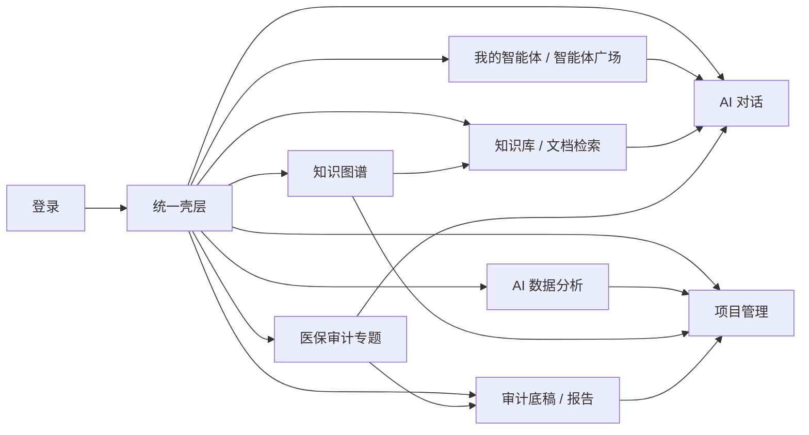

# 前端页面沟通 0710 产品对齐设计

## 1. 定稿结论

本设计将 `/Users/pray/Desktop/audit/前端页面沟通0710.pptx` 的 15 页业务反馈，收敛为 19 条可验收需求，并按已批准的七项产品决策执行。目标不是继续堆展示页面，而是把门户调整为稳定、可进入、数据来源明确的医院审计工作区。

执行顺序固定为：

1. 冻结产品与数据合同；
2. 修复登录、壳层、对话、历史、智能体等 P0 入口；
3. 收敛知识库和文档检索的数据真实性；
4. 将 AI 数据分析、底稿报告、项目管理从预告页恢复为真实工作台；
5. 建立双视图图谱、模型门禁和扩展智能体验证包；
6. 完成本地验收、只读检查和经授权的发布验收。

## 2. 证据边界

| 证据层 | 本设计采用的基线 | 可证明内容 | 不能证明内容 |
| --- | --- | --- | --- |
| 业务输入 | `前端页面沟通0710.pptx`，15 页 | 业务提出的页面差异、讨论项和优先诉求 | 技术可行性、生产已实现 |
| 稳定产品基线 | `docs/product/product-prd-medical-audit-v1-stable.md`、`product-development-plan-medical-audit-stable.md`、`product-scope-baseline-stable.md` | 医院审计 V1 范围、9 模块门户、证据链与权限原则 | 当前页面和生产运行状态 |
| 最新代码分析基线 | 2026-07-11 已刷新 `origin/main@51dfcb816a0c71928c206683f0fa7fef796e895a` | 该提交中的前后端实现、测试和文档状态 | 该时间点之后新增的远端提交 |
| 当前实现分支 | `codex/ppt-feedback-product-optimization-20260711`，基于上述 baseline 的独立 feature worktree | 本轮本地代码、测试、构建与截图证据 | merge、deploy、生产验收或真实 provider 可用性 |
| 生产记录 | 仓库内 2026-07-10 provider 门禁记录 | 模型目录可读，但当时 `available_model_aliases=[]`、`provider_call_status=not_called`、`production_env_write=false` | 当前生产仍保持同一状态；本轮未重新连接生产 |

代码实施已在独立 feature worktree 完成；根 checkout 的既有改动继续保持不变。本地验收不能替代 merge、deploy、生产验收或真实 provider smoke。

## 3. 已批准的七项产品决策

### D1 登录页采用 PPT 第 2 页方案

- 保留居中登录卡、Logo、`AI审计一体化协作平台`、账号、密码、保持登录、信息中心和登录按钮。
- 删除 `医保基金合规审计` 副标题、角色说明条、部署配置提示和“查看当前工作台”。
- 医院名称与医院 Logo 是后续部署配置项，不占用当前登录页主视觉。

### D2 导航采用“9 个主模块 + 1 个专题入口”

- 主导航固定为：AI 对话、我的智能体、智能体广场、知识库、文档检索、AI 数据分析、知识图谱、审计底稿/报告、项目管理。
- `医保审计专题` 仅保留在侧栏底部，使用独立强调色块，不再同时出现在主导航。
- 壳层只显示主品牌名，不显示 `医保基金合规审计` 小字。

### D3 我的智能体以“直接使用”为主动作

- 我的智能体卡片和详情页的主动作均直接进入 `/chat?agent={agent_id}`。
- 查看、编辑、历史版本、停用、知识配置和调用记录降为管理动作。
- 智能体广场仍采用“查看模板 -> 加入我的智能体 -> 进入 AI 对话”的安装路径。

### D4 AI 数据分析 V1 采用表格优先

- V1 优先支持 `.xlsx`、`.csv` 的字段画像、质量提示、审计信号、历史记录和项目关联。
- 文档内容提炼、归类和总结复用文档检索与 AI 对话，不在数据分析页重复建设通用文档问答。
- OCR 在病毒扫描、DLP、脱敏留存、准确率评测和文件治理门禁明确后单独立项，不进入本批交付。

### D5 知识图谱采用双视图

- 视图 A：知识依据图谱，展示知识库、文档、法规、条款和引用关系。
- 视图 B：项目证据链图谱，展示项目、规则、疑点、复核、底稿、报告和整改关系。
- 业务流程图谱依赖医院真实流程和表单输入，未取得输入前不构造伪流程。

### D6 项目可见范围采用协作权限

- 项目创建人、项目成员和获授权管理员可见。
- 非成员普通用户不可见，也不可通过直接 URL 读取项目成员、驾驶舱或报告。
- 不采用“只有创建人可见”，避免与审计负责人、业务专家和信息科协作冲突。

### D7 三个跨行业智能体进入扩展验证包

- 医疗 V1 默认市场继续只展示医疗/医保审计智能体。
- `超标准举办会议`、`违法订立与招投标文件不符的合同或协议`、`未经批准，擅自改变工程建设项目招标方式` 作为独立扩展验证包，不进入医疗 V1 默认交付范围。
- 模型目录可见不等于模型可调用；真实 provider smoke 必须在 readiness 通过且业务方单独授权后执行。

## 4. PPT 差异追踪矩阵

| ID | PPT 页 | 业务反馈 | `origin/main` 当前形态 | 定稿目标 | 优先级 |
| --- | ---: | --- | --- | --- | --- |
| R01 | 1 | 去掉“医保基金合规审计” | `AUDIT_PLATFORM_SUBTITLE` 仍在登录卡和侧栏显示 | 登录和侧栏均只显示主品牌 | P0 |
| R02 | 1-2 | 登录页按简版定稿 | 居中卡已存在，但仍有角色条、部署提示和工作台预览链接 | 删除非登录主任务内容 | P0 |
| R03 | 3 | 主品牌文字完整、Logo 一致 | 品牌常量已正确，仍需视觉回归；侧栏仍显示副标题 | 统一 `BrandLogo` 和主品牌，建立截图验收 | P0 |
| R04 | 3 | 删除重复入口 | `referenceNavigation` 含专题，侧栏底部又硬编码专题 | 主导航 9 项，专题入口唯一 | P0 |
| R05 | 3 | 专题入口上提并突出 | 底部入口已存在但缺少独立 active 合同 | 独立色块、选中态、窄屏态、正确页签标题 | P0 |
| R06 | 4 | Enter 只换行，箭头才发送 | textarea 无 Enter 提交处理，当前行为已满足 | 不改行为，补回归测试防止倒退 | P0 |
| R07 | 4 | 历史对话按钮更大并带文字 | 浮动按钮只显示 `◷` | 改为“图标 + 历史对话”胶囊按钮 | P0 |
| R08 | 5 | 不同缩放比例版式应稳定 | 智能体每页数量由 `window.innerWidth/innerHeight` 计算 | 固定每页 12 条，CSS 只负责响应式列数 | P0 |
| R09 | 6 | 点击我的智能体直接使用或进入三级页 | “立即使用”只打开本地说明面板 | 主动作直达带 agent 参数的对话页 | P0 |
| R10 | 7 | 我的智能体内容不停变化 | API/fixture 混合及动态分页会改变记录集合 | 显式来源状态；API 空结果保持空；失败不得伪装真实数据 | P0 |
| R11 | 8 | 知识库内容不停变化 | API 指标和前端 fallback 指标可并存 | 单一 catalog 响应驱动卡片、指标和状态 | P0 |
| R12 | 8 | 知识库内容不能点入 | 最新代码已有到文档、对话、图谱的 source-scoped 链接 | 保留并补齐可达性、参数和空态测试 | P1 |
| R13 | 9 | 文档首页信息应准确稳定 | 已接真实搜索，但分类统计和推荐文档仍含硬编码 fallback | 搜索、统计、列表同源；fallback 只能在显式演示模式使用 | P0 |
| R14 | 10 | 页面切换后文档数变为 0 | 运行时切换和空响应可能造成统计与列表不同步 | 空库显示真实 0；有数据时统计与 items/count 一致 | P0 |
| R15 | 11 | 通用数据分析、文档提炼、OCR 待讨论 | `/analytics` 在最新路由是预告页，上传/历史 API 已存在 | 恢复表格分析工作台；文档分析复用现有链路；OCR 后置 | P1 |
| R16 | 12 | 知识图谱以知识库为主，另有三类图谱设想 | 已有只读关系工作台，但未区分产品视图 | 增加“知识依据 / 项目证据链”双视图，流程图谱阻塞 | P1 |
| R17 | 13 | 六类模板，填写后转入项目 | `/reports` 是预告页；后端仅有 3 个医保费用底稿模板和报告工作台 API | 六类目录可见；真实模板显示可用，未交付模板显示明确阻塞；产物可关联项目 | P1 |
| R18 | 14 | 四种项目状态和项目隐私 | `/projects` 是预告页；API 仅有待启动/进行中/已归档，列表未按成员过滤 | 待开始/进行中/已完成/已归档；创建人+成员+管理员可见 | P1 |
| R19 | 15 | 接入模型并先跑三个智能体 | 模型目录已实现但仓库记录的生产 readiness 阻塞；三个提示词已在跨行业 catalog | 医疗默认范围不变；三项进入扩展验证包；provider 调用单独授权 | P1/门禁 |

## 5. 目标信息架构

壳层负责导航与入口，不复制深层业务逻辑。知识、分析、图谱、报告的产出最终都应能回到对话或项目证据链。

## 6. 运行时数据合同

### 6.1 页面状态

所有 API-first 页面统一使用以下状态：

- `loading`：请求未完成，不显示演示数字；
- `ready`：后端返回且 `store.ready=true`；
- `empty`：请求成功但真实集合为空；
- `degraded`：后端明确返回 `store.ready=false`，页面显示数据来源和限制；
- `error`：请求失败，显示重试和错误摘要，不注入看似真实的 fixture。

fixture 只允许在显式本地演示开关关闭 API reads 时使用，并必须显示“本地演示数据”。生产构建和 API reads 开启时，空集合必须保持为空。

数据来源标签分为四类：

- `api`：来自运行时接口，必须同时携带 ready/empty/degraded/error 状态；
- `catalog`：版本化产品配置，例如导航、默认医疗智能体市场和六类报告目录，不代表运行时业务数据；
- `fixture`：仅用于显式本地演示，不能出现在启用 API reads 的生产页面。
- `hybrid`：仅用于“静态产品 catalog + API 身份或历史”等可解释组合；不得混入 fixture 业务记录，也不得用来掩盖 API degraded/error。

静态产品 catalog 不调用个人智能体 API，也不伪装成 API 数据；运行时历史、项目、知识计数和报告记录不得被归类为 catalog。

### 6.2 数字一致性

- 知识库卡片、总文档数、总字符数和关联应用数来自同一 catalog response。
- 文档分类统计必须由真实搜索/catalog 响应生成，不与硬编码卡片混用。
- 切换筛选条件只改变当前集合，不改变底层总量口径。
- `items.length`、`count`、分页区间和空态必须可由同一响应互相校验。

### 6.3 可进入性

- 知识库卡片至少提供“查看文档”“进入对话”“查看图谱”三类 source-scoped 路径。
- 我的智能体主动作必须携带可解析的 agent id；chat adapter 不得只加载前四个智能体。
- 历史接口成功返回空集合时，历史抽屉显示空态，不显示 reference fixture。

## 7. 模块设计

### 7.1 登录与壳层

- 登录页只承担身份输入和进入工作台。
- 9 个主模块从单一导航常量渲染；专题入口由独立常量渲染。
- 专题不在主导航计数中，但必须有 active state、顶部标题和页签标题。
- 历史对话按钮在桌面和窄屏均可见，不遮挡输入框和主要操作。

### 7.2 对话与智能体

- Enter 是 textarea 原生换行；提交只由“发送问题”按钮触发。
- `/chat?agent={id}` 在 URL hydration 后选中对应智能体；不存在或无权限时显示明确错误，不静默回退另一个智能体。
- 我的智能体固定 12 条/页，浏览器缩放不改变当前页记录集合。
- API 成功空列表、API 失败、显式演示数据三种状态可区分。

### 7.3 知识库与文档检索

- 知识库目录 API 是统计和卡片的单一事实源。
- 文档搜索结果、来源筛选、计数、预览和对话入口保持同一 `source_collection` 范围。
- 不存在后端统计时显示“暂不可用”，不以硬编码数字替代。
- 真实 0 是合法业务状态；错误不得显示为 0。

### 7.4 AI 数据分析

- 首页恢复真实表格上传、解析结果和上传历史。
- 结果区包括：字段列表、空值、重复行、数据类型、审计信号、质量建议。
- 本批只恢复现有上传解析和历史记录，不新增上传记录的项目字段；分析结果进入项目证据链属于后续独立数据合同，避免在本批隐式修改数据库结构。
- `.xlsx/.csv` 之外的格式在前端提示且由后端 422 再次校验。
- 本批不渲染 OCR 按钮、上传控件或可点击入口；待安全与准确率门禁完成后另行设计。

### 7.5 审计底稿与报告

- 一级目录固定展示计划类、底稿类、取证类、函证类、报告类、整改类。
- 当前三张医保费用模板作为真实可用底稿类模板；其他业务未交付模板显示“待业务模板确认”，不生成假内容。
- 模板填写保存为草稿时必须带 `project_key`；转入项目后保留模板版本、创建人、更新时间和证据来源。
- 草稿写入权限独立于项目可见权限：项目内审成员、负责人和管理员可创建草稿，技术人员和非项目成员不可写；401/403/404 均留拒绝审计记录。
- 正式签发、电子签章和长期归档不因前端 demo 而被宣称完成。

### 7.6 项目管理

- 状态规范化为 `待开始`、`进行中`、`已完成`、`已归档`；旧 `待启动` 在适配层映射为 `待开始`。
- 列表字段：项目名称、专题、成员数、创建人、创建时间、状态、操作。
- 成员信息需要稳定的 `user_identifier`，显示名不能作为权限主键。
- 列表、成员、驾驶舱和关联报告使用同一可见范围检查。
- 管理员全量可见；创建人和活跃成员可见；其他用户返回 404 或过滤后的空集合，避免泄露项目存在性。

### 7.7 知识图谱

- “知识依据”视图复用现有 catalog、文档、规则和引用关系。
- “项目证据链”视图要求 `project_key`，展示项目到整改的只读关系。
- 参数合同严格互斥：`view=project` 缺少非空 `project_key` 返回 422；`view=knowledge` 携带 `project_key` 也返回 422，避免静默忽略范围参数。
- 疑点必须经 `AuditFinding -> AuditTask -> AuditProject.project_key` 关联；复核、报告和整改只纳入已关联疑点的 review task，或 dossier 明确记录同一 `project_key` 的模板草稿。没有项目键的记录不得被推断到当前项目。
- 每个节点都提供来源、证据等级和下一步入口。
- 没有医院流程输入时，页面只说明流程图谱尚未建立，不生成静态伪流程。

### 7.8 模型与扩展智能体

- 模型选择器只允许选择 `available=true` 的别名。
- provider 未就绪时保留目录和不可用原因，不触发真实调用。
- 扩展验证包通过独立 scope/feature flag 暴露三个指定智能体；医疗默认市场过滤该 scope。
- 扩展验证验收先使用本地 fake provider 完成合同测试；真实 provider smoke 必须另行授权，并记录 `provider_call=true` 的独立证据。

## 8. 权限与审计要求

- 所有项目级读取带当前用户与项目 scope，前端隐藏不替代后端鉴权。
- 智能体、分析记录、模板草稿和报告均记录创建人、项目、来源和更新时间。
- 被拒绝的项目读取、成员新增、报告签发和 provider 调用尝试进入审计日志。
- 不在日志、文档或错误信息中输出 secret、token、密码、私钥或原始个人敏感字段。

## 9. 非目标与阻塞条件

本批不包含：

- 复杂多智能体编排；
- 通用 OCR 上线；
- 业务流程图谱自动生成；
- 证书级电子签章；
- 未经授权的 provider 调用、生产环境变量写入、生产数据库写入或部署。

以下条件成立前，对应能力保持明确阻塞：

- 医院未提供流程、表单和角色输入：业务流程图谱不实施；
- 业务侧未提供六类正式模板内容：只交付六类目录和已有三张真实底稿模板；
- 模型 readiness 无可用别名：不进入真实 provider smoke；
- 项目成员没有稳定 user identifier：项目权限不能进入生产验收。

## 10. 验收层级

1. **合同验收**：单元测试证明导航数量、URL 参数、空结果、状态映射、权限过滤和模板分类。
2. **本地构建验收**：frontend test/typecheck/lint/build 与相关 backend pytest 通过。
3. **本地全栈验收**：关键路径 E2E 通过，截图覆盖 1440×900、1280×800、390×844；67%、100%、125% 缩放下记录集合稳定。
4. **只读环境验收**：只读取模型目录、知识目录、项目列表、报告工作台和上传历史，不产生业务写入。
5. **授权写入验收**：项目成员、分析上传、模板草稿等仅在明确授权的测试环境执行。
6. **生产验收**：部署、浏览器验收和 provider smoke 分开记录；任一层通过都不能替代下一层。

## 11. 实施批次与完成定义

| 批次 | 范围 | 完成定义 |
| --- | --- | --- |
| Batch 0 | 基线与合同 | 设计、API 状态、scope、权限和测试矩阵冻结 |
| Batch 1 | 登录、壳层、对话、历史、智能体 | 19 条需求中的 R01-R10 通过本地测试与视觉回归 |
| Batch 2 | 知识库、文档检索 | R11-R14 的数据来源、计数和可进入性一致 |
| Batch 3 | 数据分析、底稿报告、项目管理 | 三个预告页替换为 API-first 工作台，R15/R17/R18 通过 |
| Batch 4 | 双视图图谱、模型与扩展验证包 | R16/R19 的本地合同通过；真实 provider 保持授权门禁 |
| Batch 5 | 全量 QA 与发布证据 | 本地、只读、写入、部署和 provider 证据分层归档 |

逐文件、逐测试、逐命令的执行顺序见 `docs/superpowers/plans/2026-07-11-ppt-feedback-product-optimization.md`。

## 12. 本地实施状态

- R01-R19 对应代码已在 `codex/ppt-feedback-product-optimization-20260711` 完成本地实现，尚未 merge 或 deploy。
- 后端聚合测试：`281 passed`；前端全量测试：`32 files / 267 tests`。
- `pnpm web:typecheck`、`pnpm web:lint` 和 `pnpm web:build` 通过，静态页面 `24/24`。
- 本地 full-stack E2E：`13 passed`；本地 production-build 视觉矩阵 `45/45` passed，按文件名排序的截图 checksum 清单聚合 SHA256 为 `ab60b945d4f6327d37d1939e1d5fed3c3ad31e13fdd38bf6161fc722c9c8ed09`。
- 机器可读验收报告：`tmp/outputs/ppt-feedback-product-optimization-local-acceptance-20260711.json`；R01-R19 全部为 `pass`。
- 最终代码复审：Critical `0`、Important `0`、Minor `0`、Ready `YES`。
- 生产保持未变更：`production_side_effect=none`、`provider_call=false`、`database_write=local-test-only`。
- 已知业务阻塞保持不变：医院流程输入缺失、非底稿业务模板缺失、真实 provider smoke 需要单独授权。
