# 知识库源文件萃取到对话审证台全链路复盘与工作流规划

## 1. 结论摘要

[事实] 当前知识库已经形成可运行闭环：源文件清点、抽取、chunk、embedding、本地持久化 artifact、PostgreSQL + pgvector 导入、检索后端加载、chat 页面引用型回答、原文预览均已跑通。

[事实] 当前 live 状态：

- `GET /index/search-backend`：`backend=postgres`，`ready=true`，`matching_embedding_count=48985`。
- `GET /index/postgres-status`：`source_documents=486`，`document_chunks=48985`，`chunk_embeddings=48985`，`failed_files=0`，`pending_files=13`。
- `GET /pages/chat?question=医保基金审核依据`：页面出现 `检索已就绪`、`可追溯回答`、`检索直出`、`生成模型未介入`、`打开原文`。

[事实] 当前 chat 不是完整 LLM 对话产品。`/pages/chat` 只调用 `build_citation_backed_answer(question, results)`，没有传入真实生成模型 provider；页面显示的是“检索直出”的引用型回答。Kimi Code 作为 chat answer provider 的历史预检失败，错误为 `403 access_terminated_error`，不能把当前系统表述为“已接入 Kimi 真实对话生成”。

[事实] 当前增量能力不完整。`/index/incremental` 依赖 API 进程内 `current_snapshot`，服务重启后丢失；PostgreSQL 导入是 JSONL artifact 的 upsert 写入，没有 DB 级增量 upsert/delete、active index 隔离、旧 chunk 失活、删除源文件同步清理。

[推断] 下一阶段不应继续优先做视觉层 UI polish。先把“新增源文档后可增量更新、可回滚、可验收、不会污染检索”的工作流补完整，否则 UI 越精致，误导风险越高。

## 2. 当前真实链路

```mermaid
flowchart LR
  A["data/医保审核前期资料"] --> B["inventory: 文件清点、分类、hash、pending/ignored 判定"]
  B --> C["extractors: md/txt/pdf/xlsx 文本抽取"]
  C --> D["chunkers: 法规条款、Markdown 段落、Excel 行切分"]
  D --> E["pipeline: 生成 DocumentChunkCreate 和运行摘要"]
  E --> F["persistent_index: chunks.jsonl / bm25_documents.jsonl / embeddings.jsonl"]
  F --> G["pgvector_import_plan: JSONL 一致性门禁"]
  G --> H["pgvector_writer: source_documents / document_chunks / chunk_embeddings"]
  H --> I["postgres_search: pgvector 向量召回 + DB chunk 加载 BM25"]
  I --> J["hybrid_search: 向量、BM25、source weight、rerank 合并"]
  J --> K["answer_builder: 引用型 fallback answer"]
  K --> L["routes_pages: /pages/chat 渲染回答和证据卷宗"]
  L --> M["PreviewResolver: 打开原文预览"]
```



## 3. 分段复盘

### 3.1 源文件清点

实现位置：

- `src/medical_audit_kb/ingestion/inventory.py`

当前行为：

- 以 `data/医保审核前期资料` 为源资料根目录。
- 根据一级目录名映射 `source_collection`。
- 支持 `.md`、`.txt`、`.pdf`、`.xlsx` 作为 index candidate。
- `.png`、`.zip`、`.rar` 进入 pending。
- 法律目录额外通过医保相关关键词过滤。
- 生成文件 hash、size、duplicate groups、pending/ignored 统计。

脆弱点：

- 来源分类依赖中文目录名精确匹配，目录名改动会导致误分流。
- 法律文件的关键词过滤可能漏掉医疗保障相关但标题不含关键词的法规。
- duplicate groups 只统计，不形成阻断门禁。
- 没有 source package manifest 的人工确认环节。
- 没有 `incoming -> reviewed -> indexed -> archived` 的资料包状态流转。

### 3.2 文件抽取

实现位置：

- `src/medical_audit_kb/ingestion/extractors.py`

当前行为：

- `.md`、`.txt`：按 UTF-8 读取，保留行号 locator。
- `.pdf`：用 `pypdf.PdfReader.extract_text()` 抽取分页文本。
- `.xlsx`：用 `openpyxl` 读取所有 sheet，首个非空行作为 header，逐行结构化。
- 低质量文本或不支持类型进入 pending。

脆弱点：

- 没有编码 fallback，非 UTF-8 文本会失败。
- 扫描 PDF、图片、截图型材料无法 OCR。
- `.doc`、`.docx`、`.csv`、`.zip`、`.rar` 未形成可索引处理链。
- Excel 首行 header 启发式过弱，合并单元格、多级表头、说明行、隐藏行可能污染 chunk。
- PDF 抽取只判断文本长度，没有版面质量、乱码率、页码覆盖率评分。

### 3.3 Chunk 与 locator

实现位置：

- `src/medical_audit_kb/ingestion/chunkers.py`
- `src/medical_audit_kb/ingestion/pipeline.py`

当前行为：

- 默认 `max_chunk_chars=1800`，`overlap_chars=180`。
- 法规类按章、节、条切分。
- Markdown 按 heading 与段落切分。
- Excel 基本按行切分。
- locator 保存 `source_path`、`page_number`、`line_start`、`line_end`、`sheet_name`、`row_number`、`article_number`。
- `source_document_id` 使用 `relative_path + sha256` 生成，文件内容变化后 document id 会变化。

脆弱点：

- chunk 策略偏规则化，没有根据资料类型建立 domain-aware chunk，例如医保目录、负面清单、两库规则、法规条款应有不同切分策略。
- Excel 行 chunk 容易丢失表头、sheet 说明、批次上下文。
- 法规条款正则覆盖有限，复杂编号、附件、表格条款可能切错。
- `source_document_id` 绑定 sha256，修改文件后旧 document/chunk 与新 document/chunk 并存；如果 DB 查询不按 active package 隔离，旧内容会污染检索。
- `chunk_id` 基于 `source_document_id + chunk_index + locator`，内容修改后 chunk id 改变，利于追溯，但要求删除/失活旧 chunk，否则会残留。

### 3.4 本地持久化索引

实现位置：

- `src/medical_audit_kb/indexing/persistent_index.py`

当前行为：

- 全量执行 `KnowledgeIndexPipeline().run_full_rebuild()`。
- 写出 `summary.json`、`chunks.jsonl`、`bm25_documents.jsonl`、`embeddings.jsonl`、`failed_files.jsonl`、`pending_files.jsonl`。
- 支持 `--resume` 复用已有 provider/model/version/dimension 匹配的 embedding 行。
- Kimi 主索引当前为 48985 个 chunk/embedding，维度 1024。

脆弱点：

- `build_persistent_index()` 仍是全量 pipeline，`--resume` 只复用 embedding，不是增量源文件重建。
- 本地 artifact 在 `tmp/` 下，不应作为长期正式索引资产；目前生产导入依赖它，需明确 artifact 生命周期。
- 没有 index artifact 的 manifest 签名、校验和、保留策略。
- 中断恢复粒度是 `embeddings.jsonl` 行复用，不是 job queue 级别的可观测状态。

### 3.5 PostgreSQL + pgvector 导入

实现位置：

- `src/medical_audit_kb/indexing/pgvector_import.py`
- `src/medical_audit_kb/indexing/pgvector_writer.py`
- `sql/knowledge-query-schema.sql`

当前行为：

- `pgvector-import-plan` 校验 JSONL 文件存在、行数、重复 chunk、缺失 embedding、孤儿 embedding、metadata、dimension。
- `pgvector-import` dry-run 后显式 `--execute` 写入 PostgreSQL。
- 写入使用确定性 UUID 和 `ON CONFLICT DO UPDATE`。
- schema 固定 `chunk_embeddings.embedding vector(1024)`。
- HNSW 索引固定 Kimi `openai/kimi-for-coding/v1/1024`。

脆弱点：

- 没有 active index version 查询隔离。`index_versions.status='active'` 存在，但检索 SQL 没有 join active version。
- 没有旧版本自动失活策略。重复导入不同 package 会导致多个 active version 的数据同时存在。
- 没有删除源文件后的 DB 清理或软删除流程。
- `document_chunks` 无 `status` 字段，无法单独失活 chunk。
- `chunk_embeddings` 固定 1024 维，切换 embedding model 需要 migration 或新表。
- `pending_files` 与 `failed_files` upsert 不会自动关闭已经修复或消失的队列项。
- query logs 表存在，但当前页面查询日志主要存在内存中，未形成完整审计链。

### 3.6 检索后端

实现位置：

- `src/medical_audit_kb/retrieval/postgres_search.py`
- `src/medical_audit_kb/retrieval/hybrid_search.py`
- `src/medical_audit_kb/retrieval/filters.py`

当前行为：

- 向量召回来自 `chunk_embeddings` 的 pgvector cosine search。
- BM25 从数据库 `document_chunks` 全量加载为内存索引。
- 混合检索合并 vector 和 BM25，加入 source_collection weight。
- filters 支持 source_collection、year、region、document_type、business_topic，但当前 metadata 填充并不完整。

脆弱点：

- vector SQL 不按 active index version、document status、source package 过滤。
- BM25 每次加载全量 `document_chunks`，数据增长后启动成本和内存成本会继续上升。
- filter 在 vector 阶段是先取 `top_k * 3` 后应用 metadata 过滤，高选择性过滤可能漏召回。
- 当前 rerank 默认 FakeRerankProvider，没有真实 cross-encoder 或 LLM rerank。
- 对医保审计问题缺少 query rewriting、同义词、编码精确匹配策略的统一层。

### 3.7 回答构建与 chat 页面

实现位置：

- `src/medical_audit_kb/generation/answer_builder.py`
- `src/medical_audit_kb/generation/answer_providers.py`
- `src/medical_audit_kb/api/routes_pages.py`
- `src/medical_audit_kb/api/templates/chat.html`

当前行为：

- `answer_builder` 先按问题焦点词筛选最多 3 条 citation。
- 无 generation provider 时输出 fallback answer。
- 有 provider 时要求生成结果包含 citation marker，否则回退 fallback。
- `/pages/chat` 当前没有传入 generation provider。
- 页面显示回答、confidence、证据分组、原文预览、推荐追问。

脆弱点：

- 当前不是多轮会话，没有会话 ID、历史上下文、追问引用继承。
- 真实生成 provider 未接入页面运行路径。
- Kimi Code chat provider 历史预检失败，不能直接作为 chat model。
- fallback answer 安全但表达粗糙，不能替代专业审计结论生成。
- citation coverage 仅检查 marker，不检查“每个事实主张是否被 citation 支撑”。
- 拒答策略只存在评测和 prompt 层，页面查询路径未显式暴露“依据不足拒答”的解释结构。

### 3.8 原文预览

实现位置：

- `src/medical_audit_kb/preview/resolver.py`

当前行为：

- 文本按 locator 行号取上下文。
- PDF 按页取文本。
- Excel 按 sheet + row_number 取单行。
- highlight 基于 citation text 或 token 回退。

脆弱点：

- 预览依赖 `state.preview_references`，必须先查询后预览；链接跨进程、重启、分享后可能 404。
- PDF 只展示抽取文本，不展示原 PDF 页图。
- Excel 只展示单行，缺少表头、多行上下文和 sheet 说明。
- highlight 对 OCR/格式化文本不稳定。

## 4. 未完成任务清单

### P0：必须先补齐

- 建立正式的“源资料包接收、审查、入库、增量更新”流程文档。
- 实现 DB 级 `incremental plan`：基于上一 active package 与当前 manifest，输出 added/modified/deleted/unchanged 和影响行数。
- 实现 DB 级增量写入：新增/修改文件 upsert，新旧 package/version 隔离，删除文件软删除或从 active version 移除。
- 检索 SQL 增加 active index version 隔离，避免旧 chunk 污染结果。
- 把 `source_package_versions`、`index_versions`、`index_jobs` 作为真实运行态来源，API 启动后能恢复当前 active 状态。
- 新增 incremental 回归测试：新增、修改、删除、pending 修复、失败重试、服务重启后继续。

### P1：高优先级优化

- 增加 source audit CLI：只读扫描 source root，输出 manifest diff、pending、ignored、duplicate、质量评分。
- 增加 OCR / archive / docx 支持，至少先把 `.png`、扫描 PDF、`.zip` 纳入可解释 pending workflow。
- Excel 抽取升级为表头识别、多级表头展开、上下文行合并。
- 预览链接改为可持久解析，不依赖内存 `preview_references`。
- 对 PostgreSQL 路径运行固定 52 case 的真实 Kimi 查询向量评测，并写入正式门禁。
- query logs、operation logs 写入 PostgreSQL，保留 user、role、filters、retrieved chunks、answer summary。

### P2：产品体验与审计可用性

- 接入已验证可用的 chat answer provider，接入前必须通过 `answer-provider-smoke`。
- 将回答结构升级为：直接结论、引用依据、适用条件、缺失材料、风险提示、建议复核动作。
- 增加多轮会话：会话 ID、追问、上一轮证据继承、清空上下文。
- 增加审计任务输出：一键生成审核要点清单、证据摘录、待补材料清单。
- 增加证据质量评分：来源类型覆盖、引用数量、定位成功率、是否跨材料交叉印证。

## 5. 目标完整工作流

### 5.1 新资料进入

1. 新源文档放入资料接收区，不直接覆盖 active 数据包。
2. 生成资料包版本号，例如 `source-package-real-data-20260602-r1`。
3. 执行只读 source audit：

```bash
uv run medical-audit-kb acceptance-run \
  --source-root 'data/医保审核前期资料' \
  --output drafts/analysis/knowledge-query-source-acceptance-draft-YYYYMMDD.md \
  --json-output tmp/outputs/knowledge-query-source-acceptance-YYYYMMDD.json \
  --package-version-key source-package-real-data-YYYYMMDD-r1
```

4. 审查输出：

- 可索引文件数。
- pending 文件数及原因。
- ignored 文件数及原因。
- duplicate 文件组。
- 新增、修改、删除文件影响范围。

门禁：

- `failed_file_count` 必须为 0。
- pending 必须可解释，并形成后续处理任务。
- duplicate 必须确认是否允许。

### 5.2 增量计划

目标命令：

```bash
uv run medical-audit-kb index-incremental-plan \
  --source-root 'data/医保审核前期资料' \
  --from-active-db \
  --package-version-key source-package-real-data-YYYYMMDD-r1 \
  --output drafts/analysis/knowledge-query-incremental-plan-draft-YYYYMMDD.md \
  --json-output tmp/outputs/knowledge-query-incremental-plan-YYYYMMDD.json
```

计划必须输出：

- `added_files`
- `modified_files`
- `deleted_files`
- `unchanged_files`
- `pending_files`
- `failed_files`
- `estimated_new_chunks`
- `estimated_reused_embeddings`
- `estimated_new_embeddings`
- `db_rows_to_activate`
- `db_rows_to_deactivate`

门禁：

- deleted 文件必须有处理策略：软删除、从 active version 移除、或保留旧版本但不参与检索。
- modified 文件必须重新抽取、chunk、embedding。
- unchanged 文件必须复用现有 chunks/embeddings。

### 5.3 增量构建

目标行为：

- 只抽取 added/modified 文件。
- 为 changed files 生成新的 `source_documents`、`document_chunks`、`chunk_embeddings`。
- unchanged files 引用上一 active version 的现有 chunk/embedding。
- 生成新的 `index_version`，状态先为 `candidate`。

门禁：

- 新版本 chunk 总数 = unchanged reused chunks + changed new chunks。
- embedding 缺失数 = 0。
- orphan embedding = 0。
- locator 预览成功率达到门槛。

### 5.4 评测验收

必须依次执行：

1. JSONL / DB artifact 一致性校验。
2. PostgreSQL self-query smoke。
3. 固定 52 case retrieval evaluation。
4. 固定 answer fallback evaluation。
5. UI smoke：后端加载、chat/query 页面、preview 页面。
6. 如果接入真实生成模型，再执行 answer-provider-smoke 和真实生成评测。

当前推荐门槛：

- `recall@5 >= 0.98`。
- `citation_hit_rate >= 0.98`。
- `preview_location_success_rate = 1.0`。
- `fallback answer pass_rate = 1.0`。
- 真实生成 provider 未通过预检时，不允许在 chat 页面启用“模型生成”。

### 5.5 发布切换

目标：

- candidate version 通过所有门禁后，事务内切换为 active。
- 同一 provider/model/dimension 下只允许一个 active index version。
- 旧版本改为 `archived` 或 `inactive`。
- chat 查询只读取 active version。

必须持久化：

- source package version。
- index version。
- index job。
- evaluation report 路径。
- active switch 操作人、时间、摘要。

### 5.6 回滚

回滚策略：

- 保留上一 active index version。
- 回滚时只切换 active 状态，不删除源数据。
- 若 schema migration 失败，使用 `archive/snapshots/` 中的 PostgreSQL 快照恢复。

回滚门禁：

- 回滚后 `/index/postgres-status` 正常。
- `/index/search-backend/postgres` 可重新加载。
- UI smoke 通过。

## 6. 目标数据模型调整

建议新增或调整：

- `index_versions.status`：限定枚举 `candidate | active | inactive | archived | failed`。
- `document_chunks.index_version_id`：明确 chunk 属于哪个 index version，或新增 bridge 表 `index_version_chunks` 表示复用关系。
- `document_chunks.status`：支持 `active | inactive | deleted`。
- `source_documents.previous_document_id`：追踪修改前后关系。
- `source_documents.deleted_at`：支持源文件删除。
- `index_jobs.started_at/finished_at/error_summary`：已经存在，需完整写入每次 CLI/API job。
- `evaluation_runs`：记录检索、答案、UI smoke 评测结果。
- `query_logs`：页面和 API 查询统一落库。

关键约束：

- 查询路径必须 join active index version。
- 同一 embedding provider/model/version/dimension 只能有一个 active version。
- deleted/inactive chunk 不参与 vector/BM25 检索。

## 7. 目标命令体系

已有命令：

- `acceptance-run`
- `index-build`
- `evaluate-index`
- `evaluate-postgres-index`
- `evaluate-answers`
- `answer-provider-smoke`
- `pgvector-import-plan`
- `pgvector-import`
- `ui-smoke`

需要新增：

- `source-audit`：只读源资料质量审计。
- `index-incremental-plan`：基于 DB active version 生成增量计划。
- `index-incremental-build`：构建 candidate index version。
- `index-activate`：门禁通过后切换 active version。
- `index-rollback`：回滚到上一 active version。
- `pending-export`：导出 OCR/人工处理任务包。
- `preview-smoke`：按 sample chunks 批量验证 locator 和原文预览。

## 8. 实施优先级

### 第一阶段：把“增量计划”做成可见事实

目标：

- 新增只读 `index-incremental-plan`，不写 DB。
- 从 PostgreSQL active package 读取上一版本 source_documents。
- 与当前 source root manifest 对比。
- 输出 Markdown + JSON。

验收：

- 新增文件、修改文件、删除文件、unchanged 文件均可被测试覆盖。
- 服务重启不影响计划生成。
- 不依赖 API 内存 `current_snapshot`。

### 第二阶段：active version 隔离

目标：

- 查询 SQL 只读取 active index version。
- BM25 也只加载 active version chunks。
- 导入新版本时先写 candidate，不污染线上查询。

验收：

- 同库存在两个版本时，chat 只返回 active version chunk。
- 切换 active 后，chat 返回新版本 chunk。
- 回滚后，chat 返回旧版本 chunk。

### 第三阶段：DB 级增量写入

目标：

- changed files 重新抽取和 embedding。
- unchanged files 复用旧 chunk/embedding。
- deleted files 从新 active version 排除。

验收：

- 小样本新增/修改/删除后，无旧内容污染。
- embedding 新增量与 changed chunks 数一致。
- 回滚可用。

### 第四阶段：抽取质量升级

目标：

- OCR、docx、archive、Excel 多级表头。
- pending 队列从“统计”升级为“可处理任务”。

验收：

- 当前 13 个 pending 文件全部归因明确。
- 每类 pending 有处理状态和责任动作。

### 第五阶段：真正的对话能力

目标：

- 选择可用 chat answer provider。
- chat 页面接入 provider。
- 支持多轮、追问、拒答、引用覆盖检查。

验收：

- `answer-provider-smoke` 通过。
- `evaluate-answers` 真实生成通过门槛。
- 页面不再错误显示“模型生成”。

## 9. 下一步建议

直接执行第一阶段：实现 `index-incremental-plan`。

理由：

- 它是只读能力，风险低。
- 能立即把“新增源文档后会影响哪些文件、chunk、embedding、DB 行”变成事实。
- 它不依赖 Kimi key，不产生模型成本。
- 它是后续 DB 增量写入、active version、回滚的前置底座。

第一阶段完成后，再进入 active version 查询隔离。不能反过来先做 UI，因为当前最大风险不是页面样式，而是增量更新后检索结果可能混入旧版本资料。
