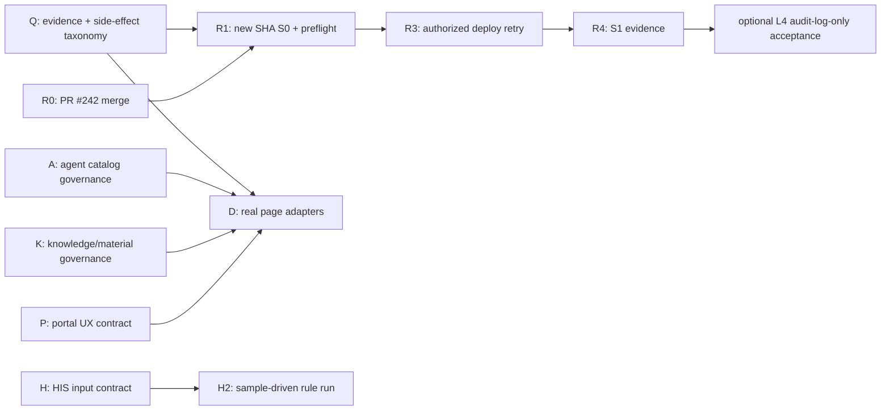

# Phase 7 产品形态与发布恢复并行执行方案

## 1. 当前事实与边界

### 1.1 执行源与发布状态

- 根工作区 `/Users/pray/project/medical_audit` 位于旧 `main`，落后 `origin/main` 172 个提交，并包含混合的前后端、知识库、计划与临时变更；本方案只把它作为规划和历史证据源，不作为发布或合并执行源。
- 当前可执行发布候选位于 `/Users/pray/project/medical_audit_phase7_main_79d6e42`。
- PR #242 的 head 为 `b8eee43cb076058042b1cfc7ba8f48cf7a273e29`，当前为 `OPEN / MERGEABLE / CLEAN`，CodeRabbit 为 `SUCCESS`，唯一 review thread 已 resolved；截至本方案生成时尚未合并。
- 上一次受控解锁后，生产锁已移除；备份仍保留，部署事务和激活均未发生。最后一组 L3 证据仍显示 runtime/database/release identity 位于旧 SHA `1376baef0d8d47f1e1ef60b2cec130451af5af4f` 且拓扑为 `legacy_ready`。该证据来自 2026-07-17；执行生产动作前必须再次刷新。

### 1.2 新产品形态

产品不是“知识库网站加页面集合”，而是单院私有化的 `AI智能审计管理系统`：以 9 模块审计门户组织工作，核心闭环是：

```text
知识依据 -> HIS 数据与规则 -> 0/1 疑点 -> 人工复核 -> 底稿/报告 -> 整改跟踪
```

已上线或已有真实能力的部分，和仍属门户壳层/本地实现的部分必须分开推进：

| 能力域 | 已有可用基础 | 不能提前宣称的状态 |
| --- | --- | --- |
| 知识支撑 | 引用型查询、原文预览、索引版本与回滚 | 全量知识文档均已 active |
| 智能体 | 提示词型智能体、持久化新增的生产 E2E 曾完成 | 100+ 智能体均已生产可调用、具备治理闭环 |
| 文档 | 生产查询；搜索历史/个人材料治理已有本地切片 | 个人材料真实索引、受控下载和对象存储治理均已上线 |
| 数据分析 | 表格上传、解析、留存和历史已有基础 | 生产级数据分析沙箱、病毒扫描和脱敏隔离已完成 |
| 报告 | 任务级复核与本地 API-first 下载切片 | 电子签章、正式报告归档和生产验收已完成 |
| HIS 审计 | DDL/样本/快照/`CHARGE-RULE-001` 开发期链路 | 院方真实 HIS 专项审计已验收 |

## 2. 并行原则

1. 发布恢复是唯一生产互斥泳道；任何部署、激活、迁移或受控写入只在该泳道内串行执行。
2. 产品建设、知识库、智能体、HIS 和视觉质量均在独立干净分支上并行；不得在旧根工作区直接开发，也不得混入 release candidate。
3. 每个泳道必须有独立的完成物、自动化验证和明确的“不可跨越边界”。本地通过、fixture、L3 只读、L4 写入验收不能互相替代。
4. 所有面向用户的“可用”声明都绑定真实 API/数据来源、权限状态和证据等级；静态 `portal-data.ts` 或 fixture 只能标为展示/演示状态。
5. 桌面 Web 是设计与验收主线；移动端只承接关键流程与无横向溢出，不另起功能范围。

## 3. 并行泳道与交付物

### Lane R：发布恢复与生产证据（串行、唯一生产写入泳道）

**目标**：把 legacy->versioned 首次迁移从“备份完成但未激活”恢复为可审计的发布闭环。

| 阶段 | 完成物 | 验收与边界 |
| --- | --- | --- |
| R0 | 合并 PR #242，冻结新的 `main` SHA | 合并是单独动作；不得直接复用旧 SHA 部署 |
| R1 | 新 SHA 的 clean-main、源/lock/tree 身份包 | 本地静态、脚本和 Web 相关门通过 |
| R2 | 新鲜 L3 S0 + zero-execute preflight | 必须精确确认 `legacy_ready`、锁不存在、备份存在、无事务/激活；无 deploy/provider/schema/review-write |
| R3 | 首次 versioned deploy retry | 仅在新的逐项生产部署授权下执行；不启用 schema、provider 或 review-write flags |
| R4 | L3 S1 与 S0->S1 比对 | 证明 current/release manifest/deploy SHA/runtime/DB 身份一致；无 L4 不宣称权限和真实业务写入已验收 |
| R5 | 可选 L4 前端/权限验收 | 仅在 audit-log-only 明确授权后运行；单独统计 audit log side effect |

**禁止并行**：R3 与任何其他生产写入、知识索引 activate、HIS staging execute、真实附件上传并行。

### Lane P：门户信息架构与桌面专业度

**目标**：把 9 模块从“同壳页面”收敛成统一的审计工作系统，而非继续零散微调。

1. 冻结桌面主导航、顶部多标签、页面标题、状态条、空态、加载态、权限态和错误态的设计契约。
2. 建立 9 模块页面矩阵：AI 对话、我的智能体、智能体广场、知识库、文档检索、AI 数据分析、知识图谱、底稿报告、项目管理。
3. 对每页标注 `real-api`、`read-only-api`、`fixture`、`local-only`、`write-gated`，前端不得伪装数据状态。
4. 先解决共享 shell、信息密度、字号层级、表格与操作区，再进行单页微调；移动端只验收 390px 关键路径、触控目标与零横向溢出。

**完成物**：页面状态矩阵、共享设计 token、桌面截图基线、关键路由桌面/移动 smoke。

**依赖**：可与 Lane K/A/D/H 并行；在 Lane R3 前只能产出本地候选。

### Lane A：智能体产品化与“100+”目录真实化

**目标**：将提示词型审计智能体从少量可创建记录，提升为可治理、可检索、可调用、可证明的目录能力。

1. 定义智能体产品实体：模板/自建、专题、适用角色、提示词版本、关联知识库、关联项目、可见范围、生命周期和效果反馈。
2. 先交付“目录真实化”：分类、搜索、分页、计数、空态、上下架与软归档读模型；只把有真实持久化来源的项计入生产数。
3. 将真实对话调用挂接为显式 write/provider gate，保留引用、知识库范围和审计日志 attribution；不引入复杂多步编排。
4. 建立 100+ 目录导入/校验包：唯一 key、分类覆盖、提示词版本、知识库映射、可见范围、模板质量与禁用状态。

**完成物**：agent schema/contract、catalog import validator、管理页与广场页 API 适配、目录质量报告、调用/反馈最小事件模型。

**验收**：目录数、可见数、禁用数、分类数分别可复算；“100+”只能在生产 API 返回、权限过滤、分页和抽检调用均通过后对外宣称。

### Lane K：知识库与个人材料治理

**目标**：从“可查询的现有医疗库”推进到“可解释的资料覆盖与受控个人材料”。

1. 将四类医疗资料、目录覆盖、pending/excluded/manual-review 分别纳入可视化覆盖台账；禁止以文件总数替代 active 证据。
2. 完成个人材料状态机的本地 contract、title-only/权限查询、策略扫描/DLP 标记和受控下载闭环；真实向量索引、对象存储与外部扫描另设写入门。
3. 把知识库三类展示绑定实际 collection、版本、文档数、更新时间和可见范围，不把静态文案当作索引证明。
4. 为后续全量语料工作建立 provider/DB/activation 三段式执行包，先保留 no-write 预检、评测和回滚路径。

**完成物**：coverage ledger、collection/catalog API contract、personal-material lifecycle contract、provider/DB/activation gate packet。

### Lane D：文档、数据分析、报告和项目的 API 化

**目标**：优先清偿最影响门户可信度的静态数据债，而非同时把所有页面改造成写系统。

推荐顺序：

1. 文档检索搜索历史生产部署与权限可见范围。
2. 报告页 API-first 下载生产验收，明确模板、复核任务、证据与 Word 下载来源。
3. AI 数据分析上传历史、文件留存元数据、质量提示与治理状态 API；病毒扫描/对象存储/脱敏改写保持独立依赖。
4. 项目成员 read model 与角色可见范围，随后才推进真实权限生效。
5. 图谱、知识库广场和整改页面先提供真实 read model；创建、导出、签发、整改状态变更均维持 write-gated。

**完成物**：每页 adapter、API contract、空/错/权限状态、mock-to-real migration tests、审计日志 side-effect classification。

### Lane H：HIS 首场景与 0/1 审计闭环

**目标**：把现有开发期 `CHARGE-RULE-001` 链路转为可接入院方输入的首个专项审计 MVP。

1. 与院方确认收费合规/重复收费与目录限制核验是否为首场景；确认前只维护 fixture 和子 PRD，不做正式业务语义扩张。
2. 并行准备 DDL 接收模板、字段字典、脱敏规则、样本质量门禁、映射 review 和验收样本标注规范。
3. 在脱敏样本到位后，按 `DDL -> mapping -> staging -> snapshot -> rule run -> finding evidence -> review -> report gate` 串行执行。
4. 建立真实数据与 fixture 的隔离，以及数据快照、规则版本、运行批次、疑点证据和复核结果的可复测性标准。

**外部依赖**：院方 HIS DDL、字段字典、脱敏样本、报告模板、验收口径和责任人确认。

### Lane Q：质量、权限和可观测性基线

**目标**：为以上并行建设提供统一的可信度标尺，防止“页面可见”被误报为“业务可用”。

1. 修正所有 production-readonly 工具的 side-effect 标签；将 audit-log-only 验收从严格只读流中剥离。
2. 建立页面/API/数据/权限/写入/生产证据六维状态矩阵，并在 release dashboard 中输出。
3. 固化桌面优先的视觉回归、移动关键路径、真实 API contract、L3 release guard 和 L4 audit-log-only acceptance 的层级。
4. 为 100+ 智能体、知识库、文档、分析、报告、HIS 任务分别定义不含 provider call 的健康指标和写入指标。

## 4. 并行编排



### Wave 0：立即可启动（本地/只读）

- P：9 页面状态矩阵与桌面体验审计。
- A：智能体目录数据模型、100+ 准入标准和现有 catalog inventory。
- K：资料覆盖 ledger 与个人材料治理 contract 审计。
- D：各页面 `portal-data.ts`/真实 API/写入门的迁移优先级清单。
- H：首场景子 PRD、DDL/字段/样本交付模板和 `CHARGE-RULE-001` fixture 回归。
- Q：readonly/audit-log-only/provider/DB-write 分类审计。
- R：仅合并前的 PR 状态冻结；不执行 deploy。

### Wave 1：产品真实化（并行开发）

- A、K、D、P、H、Q 分别在独立干净分支开发并各自提交最小 PR。
- R0/R1 在得到发布授权后执行，且不与任何生产写入交叉。
- P 只消费 A/K/D 的契约和可见状态，不等待其全部写路径完成。

### Wave 2：集成候选与验收

- 合并后的 A/K/D/P/Q 进入一个有文件清单的集成候选。
- 本地通过后执行 L3 production-readonly S0、preflight；生产 deploy 仍是独立授权。
- H 在院方真实输入到位前不阻塞门户 read model，但不允许用 fixture 代替院方验收。

## 5. 优先级与资源上限

| 优先级 | 泳道 | 原因 |
| --- | --- | --- |
| P0 | R、Q | 当前 release recovery 和证据分类决定后续生产动作是否可信 |
| P1 | P、D、A | 桌面门户专业度、真实页面状态和智能体目录决定新产品形态是否成立 |
| P2 | K | 知识支撑和个人材料治理决定引用型结论的范围边界 |
| P2 | H | 是 V1.0 业务主链，但受院方输入依赖，不应阻塞 P0/P1 |

建议同时保持不超过 4 个本地开发泳道：`P`、`A`、`D`、`K`。`H`以需求/数据准备方式并行，`Q`作为所有 PR 的独立质量门，`R`只在授权窗口内由单一操作者执行。

## 6. 首批可执行 TODO

- [x] R0：PR #242 已合并，冻结 merge SHA `3c82412b2dabe74517917897aa385d9038e7c251`。
- [ ] R1：对 merge SHA 执行 L3 S0 与 zero-execute preflight；确认解锁后仍为 `legacy_ready`。
- [x] Q1：输出 production-readonly 与 audit-log-only 工具分类清单，先修正错误标签。
- [x] Q2：收紧 documents/chat production probe 的精确 origin 与 no-redirect 边界，并将 permission smoke 的 audit-log-only 确认绑定至精确 production origin；仅本地候选。
- [x] Q3：独立审查 Q1/Q2 候选，确认通过后按授权提交、推送并创建 PR；生产部署不在本门执行。
- [ ] P1：输出 9 模块页面状态矩阵和桌面基线截图/溢出矩阵。
- [ ] A1：审计 agent catalog 的真实来源、数量、分类、生命周期和权限字段；冻结“100+”准入规则。
- [ ] D1：按文档、报告、分析、项目、图谱、整改拆分 API adapter backlog，先选一个只读 read model 切片。
- [ ] K1：生成 active/candidate/pending/excluded 的资料覆盖 ledger，并审计三类知识库页面的真实数据来源。
- [ ] H1：形成收费合规首场景输入包：DDL、字段字典、脱敏样本、报告模板、验收口径和责任人清单。
- [ ] R3：仅在新的部署授权下执行首次 legacy->versioned deploy retry。

## 7. 方案验收

本方案成立的标准不是“同时开很多任务”，而是：

1. 任一页面都能回答其数据来源、权限状态、证据等级和写入边界。
2. 100+ 智能体、知识库规模和产品功能只使用可复算的实际数据，不使用静态占位数。
3. 生产发布、provider 调用、数据库写入、附件上传、索引 activate 和报告签发全部保留独立授权与验收。
4. HIS 专项审计在院方输入到位后可接入同一条版本化证据链，而不推倒门户和知识支撑层。

## 8. Wave 0 执行记录（2026-07-18）

### 已完成的只读审计与本地修正

- **R0**：PR #242 已在合并前确认 `OPEN / MERGEABLE / CLEAN` 与 CodeRabbit `SUCCESS`，随后合并到 `main`；GitHub merge commit 为 `3c82412b2dabe74517917897aa385d9038e7c251`。本轮未运行 S0、preflight、deploy 或任何生产写入。
- **P/A**：9 个门户路由存在 real-api、feature-flag fixture 与本地展示三类状态；生产端“100+ 智能体已可用”不能成立。当前广场默认仅 3 个模板、扩展 flag 最多 6 个；169 条前端素材去重后为 132 条，尚未成为后端可治理目录。
- **K/D**：知识库 catalog、文档纯检索、个人材料列表、分析、报告、项目、图谱与整改的读模型边界已盘点。个人材料 UI 的 `/index` 仅更新本地 metadata，未进入正式检索；整改页面仍为 API 形状的只读 seed，不能称为持久整改闭环。
- **H**：既有 `drafts/docs/workflow-his-data-delivery-template-draft-20260604.md` 已覆盖 DDL、字段字典、脱敏样本、正反例、报告模板及 staging 流程；`CHARGE-RULE-001`、DDL、映射、样本、快照、staging 相关目标测试在本地命令中完成，无生产/院方数据调用。
- **Q1**：确认 `/api/backend/index/search-backend` 虽为 GET，但会记录 `search-backend-status-view` audit event。因此在独立 clean branch `codex/phase7-readonly-evidence-guard` 中将其从 documents strict-readonly probe 与 L3 coverage 移除，列为 audit-log side effect blocked；新增真实 `TestClient + audit_log_store` 回归和脚本回归。该改动仅本地，尚未 commit、push、merge 或 deploy。
- **Q2**：documents/chat production probe 现只接受精确 `https://audit.lute-tlz-dddd.top` origin（等价 HTTPS `:443`），并停止跟随 redirect；permission smoke 只有在 `--allow-audit-log-writes`、host 确认和精确 production origin 同时满足时才执行完整受保护 GET 矩阵。新增 origin、redirect 与错误 origin 回归。该改动与 Q1 同属本地候选，尚未 commit、push、merge、访问生产或产生 audit-log 写入。
- **Q3**：候选经本地 `codex review --uncommitted`、完整相关 pytest、Ruff、`py_compile` 与 diff 检查后提交为 `d639a11`；基于真实 GitHub `main@3c82412` rebase 为 `7c66dfc`，推送并创建 PR #243。GitHub 记录为 `OPEN / CLEAN`、无 required checks；按本轮自动授权合并，`main` 现为 merge commit `0f768ff1c54831f7f74b3fa99c5744bed2b1f8f7`。该门只产生 Git side effect，未访问生产。

### 新发现的后续门

1. 受保护的 GET 在身份缺失或禁用时可能写入 `authorization-denied` 审计日志；documents/chat/默认 production smoke 不能在未进行 audit-delta 归因时标称 strict L3 no-write。
2. Q2 已在本地候选中收口，但在独立评审、合并和重新生成 release candidate 前，不能将修正后的脚本用作新的 L3/L4 生产验收依据。
3. Q1/Q2 已进入 `main@0f768ff1c54831f7f74b3fa99c5744bed2b1f8f7`；R1 的新 SHA S0 / zero-execute preflight 进行中。R3 仍须在候选重新验证后进入最终生产部署确认门。
